# Using SSL with MQ

### Audience level
Intermediate or advanced; Users should have an understanding of MQ, RACF, Java, SSL/TLS  
### Skillset
z/OS Systems Programming, MQ Administration

### Background
IBM MQ for z/OS customers are continually looking for methods to keep their environments secure. Understanding how to use SSL/TLS with z/OS is critical to keeping up with encryption requirements. In this lab, you will set up the infrastructure for certificates in a IBM MQ environment and implemented SSL security between MQ Explorer and a z/OS queue manager.

### Overview of exercise

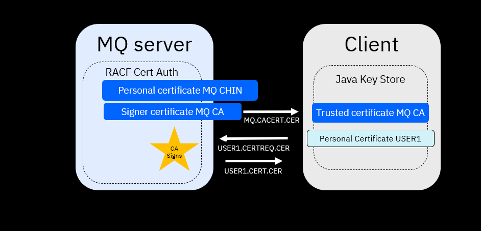

In the first part of this exercise, we will generate a self-signed certificate connecting z/OS to our client. This step is necessary to create the TLS infrastructure to be used for channel encryption. 

We will do this by generating a certificate authority and personal certificate on z/OS using the RACF Certificate Authority, then we will export the certificate as a trusted certificate to our client, then we will configure a java keystore on our client-side, generate a personal certificate on the client-side and sign the client's personal certificate using our z/OS certificate authority. 

Please note: self-signed certificates should only be used in lab or test environments. They should not be used in production environments.

In the second part of this exercise, we will implement channel encryption to securely connect to a sample queue manager running on z/OS. We will do this by adjusting settings on our queue manager, mainly using MQ Explorer.

### Lab begin

#### I. Set up the z/OS side

1. Use the TSO command RACDCERT CERTAUTH GENCERT command to create a signer
certificate with label 'MQ CA'.

    ```
    racdcert certauth gencert subjectsdn(CN('MQ CA') OU('ATS')
    O('IBM') C('US')) withlabel('MQ CA') keyusage(certsign)
    notafter(date(2029/12/31)) 
    ```

    | Parameter | Meaning |
    | ------- | -------- |
    | subjectsdn(CN('common-name') OU('organizational-unit-name1') O('organization-name') C('country')) | Specifies the subject's X.509 distinguished name, which consists of the following components: CommonName - specified with the CN subkeyword. Organizational Unit - specified with the OU subkeyword. Multiple values can be specified for the organizational unit. Country - specified with the C subkeyword. |
    | withlabel | Specifies the label assigned to this certificate. If specified, this must be unique to the user ID with which the certificate is associated. If not specified, it defaults in the same manner as the WITHLABEL keyword on the RACDCERT ADD command. |
    | signwith | Specifies the certificate with a private key that is signing the certificate. If SIGNWITH is specified, it must refer to a certificate that has a private key associated with it. If no private key is associated with the certificate, an informational message is issued and processing stops. | 
    | notafter | Specifies the local date and time after which the certificate is no longer valid 
    
2.      Use the RACDCERT CERTAUTH GENCERT command to create a personal certificate for the
MQ channel initiator (CHIN) with a label of 'MQCHIN'.

    ```
    racdcert id(SYSPROG) gencert subjectsdn(CN('MQ CHIN') OU('ATS')
    O('IBM') C('US')) withlabel('MQ CHIN') signwith(certauth
    label('MQ CA')) notafter(date(2029/12/31) 
    ```

| Parameter | Meaning |
| ------- | -------- |
| subjectsdn | Specifies the subject's X.509 distinguished name, which consists of the following components: CommonName - specified with the CN subkeyword. Organizational Unit - specified with the OU subkeyword. Multiple values can be specified for the organizational unit. Country - specified with the C subkeyword. |
| withlabel | Specifies the label assigned to this certificate. If specified, this must be unique to the user ID with which the certificate is associated. If not specified, it defaults in the same manner as the WITHLABEL keyword on the RACDCERT ADD command. |
| signwith | Specifies the certificate with a private key that is signing the certificate. If SIGNWITH is specified, it must refer to a certificate that has a private key associated with it. If no private key is associated with the certificate, an informational message is issued and processing stops. | 
| notafter | Specifies the local date and time after which the certificate is no longer valid. |

> ***Tech-Tip:** SYSPROG is the MQ channel initiator region’s RACF identity under which the CHIN started task is executing.*

3\.    Run the command 

        racdcert certauth list(label('MQ CA'))

Your output should look like this:

                                                                
        Digital certificate information for CERTAUTH:           
                                                                
        Label: MQ CA                                          
        Certificate ID: 2QiJmZmDhZmjgdTYQMPB                  
        Status: TRUST                                         
        Start Date: 2025/03/10 00:00:00                       
        End Date:   2025/03/31 23:59:59                       
        Serial Number:                                        
                >00<                                             
        Issuer's Name:                                        
                >CN=MQ CA.OU=ATS.O=IBM.C=US<                     
        Subject's Name:                                       
                >CN=MQ CA.OU=ATS.O=IBM.C=US<                     
        Signing Algorithm: sha256RSA                          
        Key Usage: CERTSIGN                                   
        Key Type: RSA                                         
        Key Size: 2048                                        
        Private Key: YES                                      
        

> ***Tech-Tip:** The common name (CN), organization unite(OU), organization(O) country (C) , labels and aliases are case sensitive. Subsequent RACF or keytool commands referencing a label, an alias or common name, etc. in any command must use the exact same case and spacing when referring to the values of these fields in the certificate (i.e. be consistent).*

*For example, command racdcert certauth list(label(‘MQ CA’)) would display this certificate while command racdcert certauth list(label(‘mq CA’)) would not. Command racdcert certauth delete(label(‘MQ CA’)) could be used to delete this certificate while command racdcert certauth delete(label(‘mq CA’)) could not.*

4\. Use the RACDCERT ADDRING command to create a RACF Key Ring for the MQ CHIN region’s RACF identity. The signer certificates and WMQ’s personal certificates will be connected to this key ring.

        racdcert id(user1) addring(MQCHIN.KeyRing) 

> ***Tech-Tip:** RACF key rings are case sensitive so be sure to enter the key ring name, e.g. MQ.KeyRing in exactly the same case in subsequent commands.*

> ***Tech-Tip:** SYSPROG needs READ access to FACILITY resource IRR.DIGTCERT.LISTRING in order to access this key ring.*

5\. Use the RACDCERT CONNECT command to connect the MQ signer certificate that was used to sign the ‘MQ CA’ client’s personal certificate to the MQ CHIN’s key ring.

        racdcert id(SYSPROG) connect(ring(MQCHIN.KeyRing) label('MQ CA') certauth usage(certauth)) 


> ***Tech-Tip:** A RACF key ring is unique to the owning user. So connecting a signer certificate labeled “MQ CA” with command RACDCERT ID(USER1) CONNECT(RING(MQCHIN.KeyRing) has no effect on a key ring labeled MQCHIN.KeyRing owned by user USER2.*

6\. Use the RACDCERT CONNECT command to connect the MQ CHIN region's persional certificate to the MQCHIN.KeyRing. 

        racdcert id(SYSPROG) connect(ring(MQCHIN.KeyRing) label('MQ CHIN') default)

> ***Tech-Tip:** The default parameter indicates that this is the personal certificate that will be provided to the remote application during a connection request.*

7\. Use the RACF RACDCERT LISTRING command to display the MQCHIN.KeyRing contents

        racdcert id(SYSPROG) listring(MQCHIN.KeyRing)

8\. The MQ signer certificate needs to be exported and installed in the client's trust stores. Use the RACDCERT CERTAUTH EXPORT command to export the MQ signer certificate from RACF into a sequential dataset.

        racdcert certauth export(label('MQ CA')) dsn(mq.cacert.cer)

#### II. Configuring the MQ Explorer SSL Support

1. Open a command window and enter the following:

        user1@129.40.114.132's password:
        Connected to 129.40.114.132.
        sftp> cd //'USER1'
        sftp> ls /+mode=text
        /+mode=text
        sftp> get MQ.CACERT.CER
        Fetching //USER1/MQ.CACERT.CER to MQ.CACERT.CER

2. Import the MQ Certificate Authority certificate using the keytool import command to import the signer certificate into local trust store file(e.g. USER1.jks) and indicate that this is a trusted signer certificates (-trustcacerts)

        keytool -import -v -trustcacerts -alias "MQ CA" -file MQ.CACERT.CER -keystore USER1.jks

3. Use the keytool genkey command to generate a self-signed certificate with the desired distinguished name specification. This is required in order to generate a certificate request that will be sent to RACF for signing by the MQ CA certificate.

        keytool -genkey -alias "USER1" -dname "CN=USER1, OU=ATS, O=IBM, C=US" -keystore USER1jks -keyalg RSA

4. Use the keytool certreq command to extraact the self-signed certificate to a certificate request file that can be uploaded to z/OS.

        keytool -certreq -alias "USER1" -file certreq.cer -keystore USER1.jks

5. Use ftp to move the certificate request to z/OS.

        user1@129.40.114.132's password:
        Connected to 129.40.114.132.
        sftp> cd //'USER1'
        sftp> ls /+lrecl=256,recfm=vb,blksize=0
        /+lrecl=256,recfm=vb,blksize=0
        sftp> mput certreq.cer

6. Browse USER1.CERTREQ.CER and you should see something like this below:

        ---------BEGIN NEW CERTIFICATE REQUEST----------
        JASKHUGSIteusheughaoer8hoiueahgkshrekughkurehgr
        ...
        ----------END NEW CERTIFICATE REQUEST-----------

7. After uploading the certificate request to z/OS, use the RACDCERT GENCERT command to sign the certificate request with the RACF MQ signer certificate and associate this certificate with a valid RACF identity (e.g. USER1).

    racdcert id(USER1) gencert(certreq.cer) withlabel('USER1') signwith(certauth label('MQ CA')) notafter(date(2029/12/31))

8. Export the signed client certificate request file to a sequential z/OS dataset using the RACDCERT EXPORT command.

    racdcert id(USER1) export(label('USER1')) dsn(cert.cer)

9. Browse USER1.CERT.CER and you should see something like below:

        -------BEGIN CERTIFICATE --------
        ADSUHFAKURENJJLANFJLRELUGNAJKFNVA
        ...
        ------END CERTIFICATE------------

10. Use ftp to move the signed certificate in dataset USER1.CERT.CER to Windows

        user1@129.40.114.132's password:
        Connected to 129.40.114.132.
        sftp> cd //'USER1'
        sftp> ls /+mode=text
        /+mode=text
        sftp> get USER1.CACERT.CER
        Fetching //USER1/CERT.CER to USER1.CERT.CER

11. Use the keytool -import command to import the signed certificate into the JSSE keystore.

        keytool -v -import -alias "USER1" -file CERT.CER -keystore USER1.jks

> *Tech-tip* If the message “Certificate reply was installed in keystore” is not displayed then there was problem somewhere in this process. Steps 2 to 12 could repeated after removing file user1.jks and deleting the USER1 certificate with command racdcert id(USER1) delete(label('USER1')

12\. To recap, in this part of the exercise, we configured a self-signed certificate.


#### III. Configure channel encryption

1\. At this point, we have to adjust queue manager settings for our z/OS queue manager ZQS1. Start by opening MQ Explorer.

2\. Modify RACF key ring (SSLKEYR) to be accessed for personal and certificate authority digital certificates

        /ZQS1 ALTER QMGR SSLKEYR('MQCHIN.KeyRing')


3\. Modify the number of SSL sub tasks (SSLTASKS) for processing SSL calls

        /ZQS1 ALTER QMGR SSLTASKS(5) 

4\. Restart CHINIT address space

        /ZQS1 STOP CHINIT
        /ZQS1 START CHINIT
        
5\. Start MQ Explorer on your desktop. Click on Window on the tool bar and then click on Preferences. Expand the MQ Explorer option and then expand Client Connections. Select SSL Key Repositories preferences. Check the box beside 'Enable default SSL key repositories' and then use the 'Browse' buttons to select the key store configured earlier in this exercise (e.g. USER1.jks) for both for Trusted Certificates and Personal Certificates store files. Use the Enter password button to enter the password for both store files.

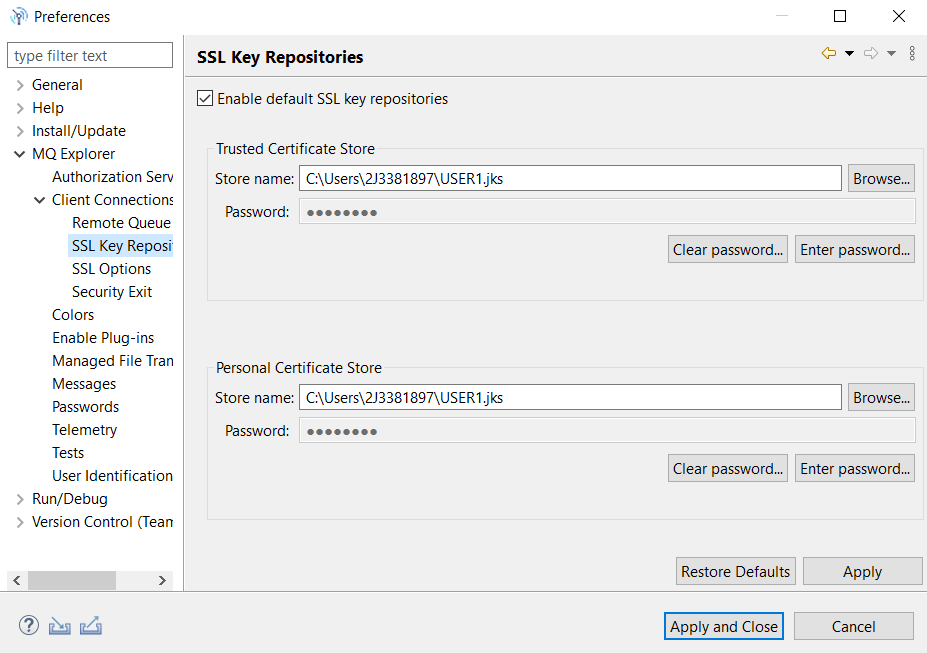

6\. Click Apply and Close to continue.

7\. Switch to the SSL Options preference window. Check the box beside 'Enable default SSL options' and then use the pull down to select a SSL CipherSpec of ECDHE_RSA_AES_128_CBC_SHA256. Click 'Apply' and 'Close' to continue.

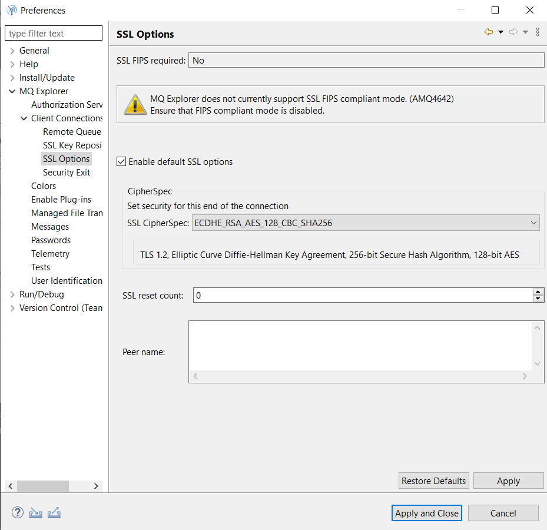

> Tech-Tip: Which cipher suite selected is not important as long as the same cipher is used consistently. 

8\. Using an existing non-SSL connection to QMZ1, create a new server connection channel by selecting 'Channels' and right-clicking 'Select New' -> Server-connection Channel'. Enter a nameof USER1.SSL.SVRCONN and click 'Next' to continue.

9\. On the 'New Server-connection Channel' window, select 'SSL' and use the pull down arrow to select ECDHE_RSA_AES_128_CBC_SHA256 as the SSL CipherSpec. Select 'General' to
continue.

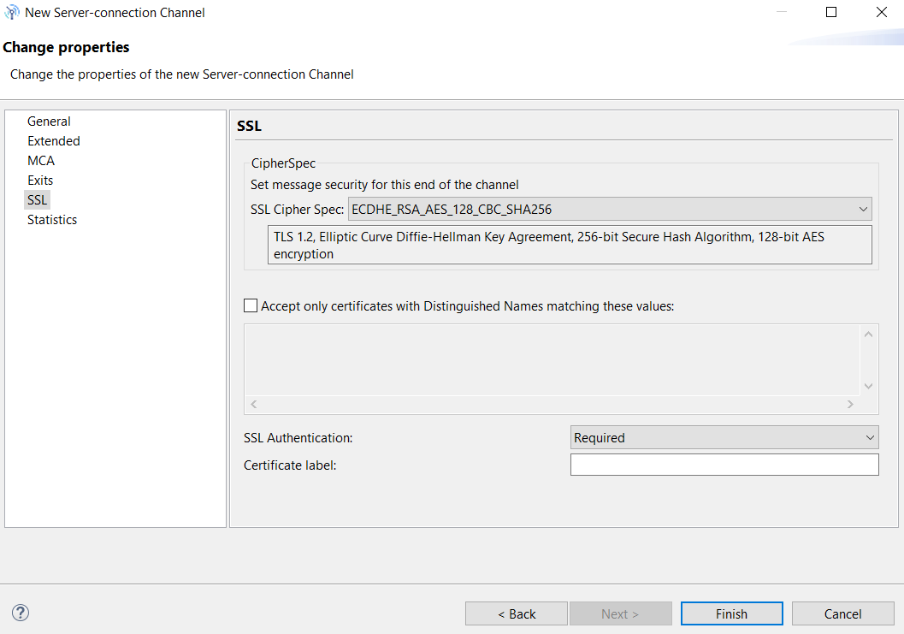

10\. On the General window use the pull-down arrow to select TCP. Click Finish to continue.

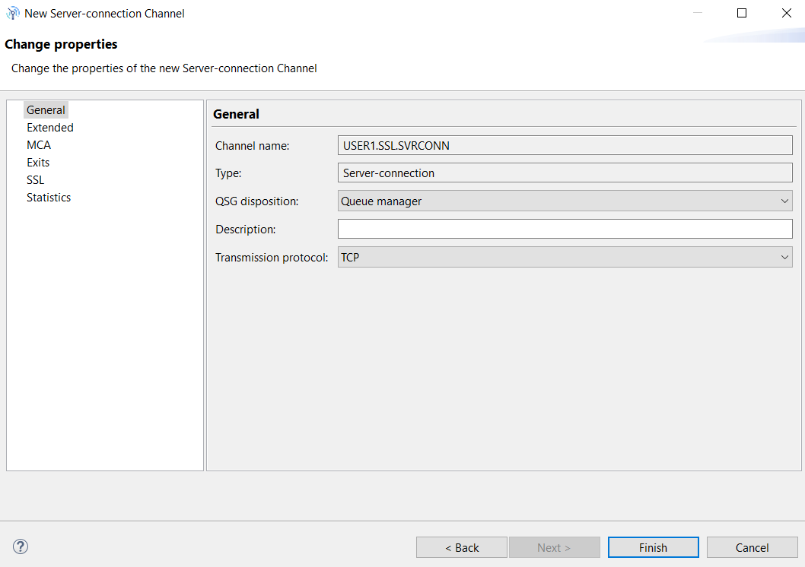

11\. Next a Channel Authentication record needs to be added to allow access to the
USER1.SSL.SVRCONN channel. Using a non-SSL connection to ZQS1, expand 'Channels' and
select 'Channel Authentication Records'. 

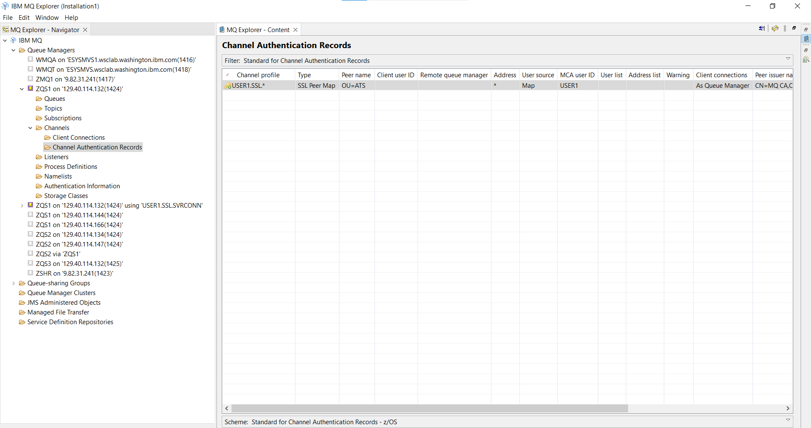

12\. Right-click and select 'New -> Channel Authentication Record' to display the 'New Channel Authentication Record – Create a Channel Authentication Record' window. Take the default for the 'Rule' type (Allow access) and press 'Next' to continue.

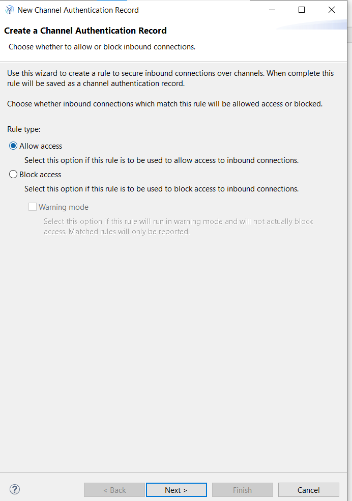

13\. On the 'Match' part of the identity window, select the radio button by 'SSL/TLS Distinguished Name'. Click 'Next' to continue.

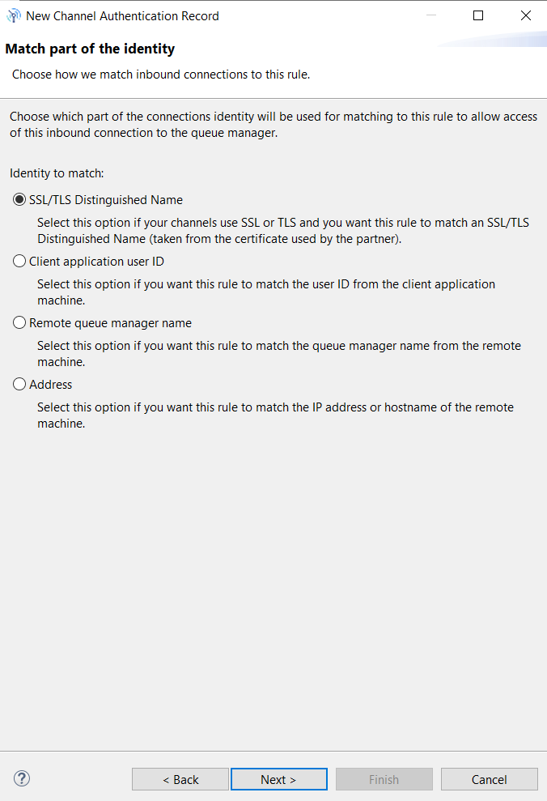

14\. On the 'Matching the channels window', enter USER1.SSL.* in the area under Channel Profile. Press 'Next' to continue.

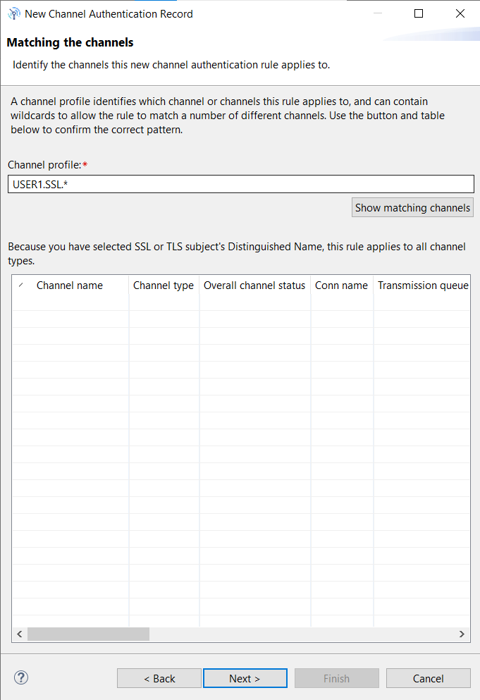

15\. On the Matching SSL/TLS Distinguished Names window enter 'OU=ATS' as the SSL/TLS
subject’s Distinguished Name pattern and 'CN=MQ CA,OU=ATS,O=IBM,C=US' as the SSL/TLS
issuer’s Distinguished Name pattern. Enter an asterisk (*) for the IP address or hostname
pattern. Click Next to continue. 

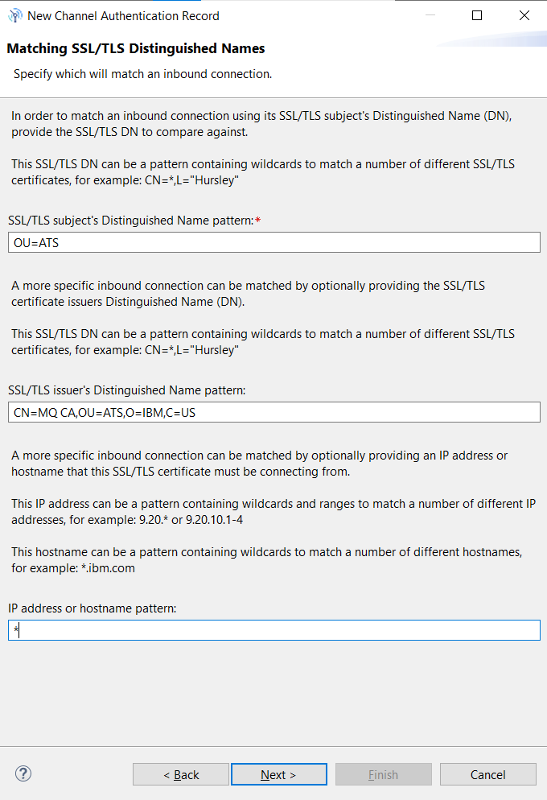

16\. On the Authorization user ID window click the radio button beside 'Fixed user ID' and enter 'USER1' as the 'User ID'. Press 'Next' 3 times to continue. 

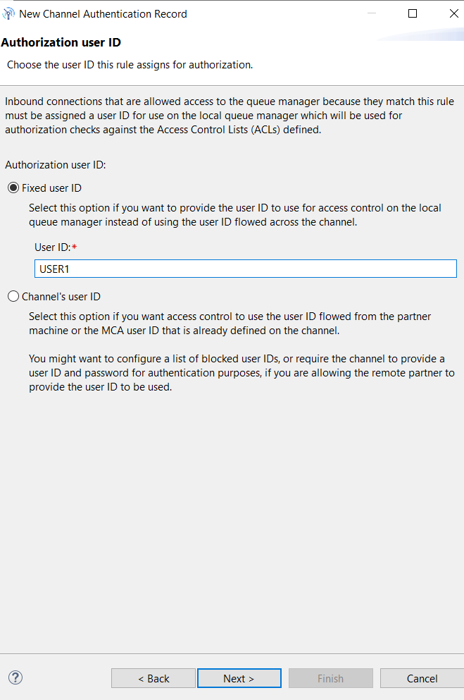

17\. Click 'Finish' on the Summary window to complete the definition of this authentication rule. 

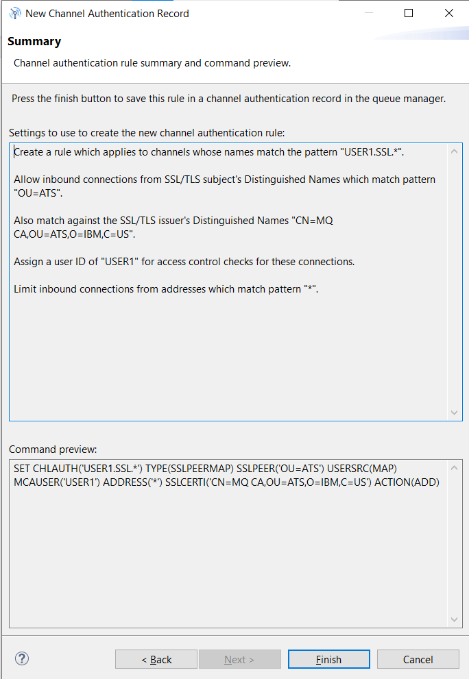

18\. Next, create a new remote connection to queue manager ZQS1.

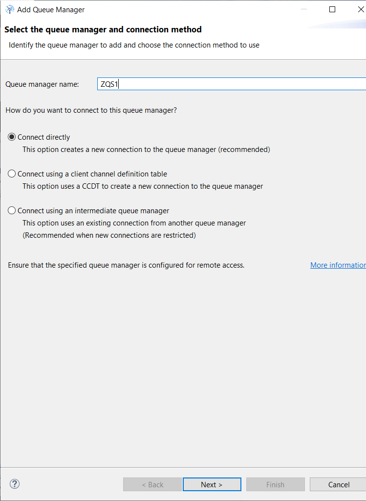

19\. On the 'Specify new connection details' window, enter the appropriate z/OS LPAR IP address as the 'Host name', 1424 as the 'Port Number' and USER1.SSL.SVRCONN as the 'Server-connection channel' name. Click Next 3 times to continue. 

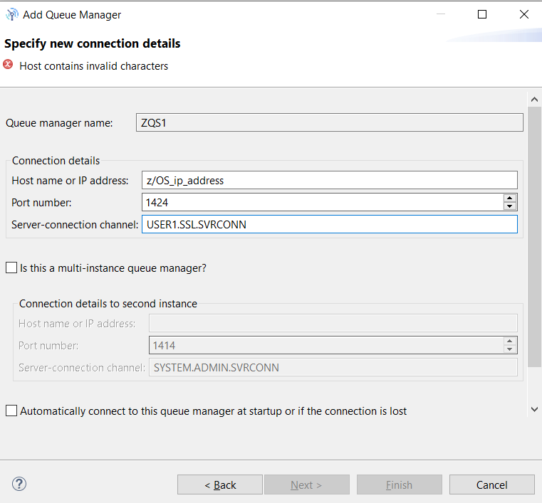

20\. On the 'Specify SSL certificate key repository details' window, ensure the box beside 'Enable SSL key repositories' is checked. If the 'Trusted Certificate Store' is not configured, use the 'Browse' and 'Enter' password buttons to provide this information. Click 'Finish' to continue.

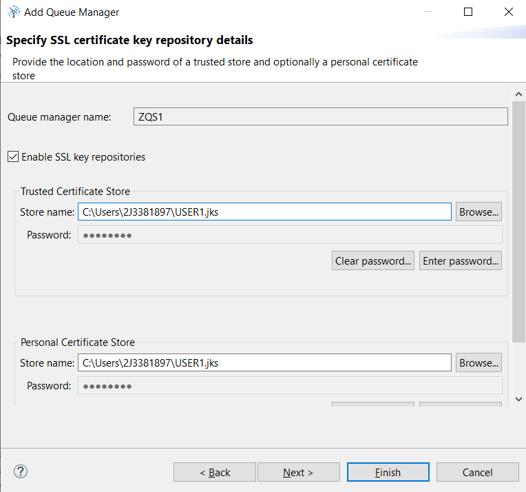

21\. You should now be connected to the queue manager using SSL. To confirm enter this MVS
command:

        ZQS1 display chstatus(USER1.*) mcauser sslcertu 

The RACF identity associated with the client’s certificate is displayed in the SSLCERTU
property

```
 CSQM201I ZQS1 CSQMDRTC  DISPLAY CHSTATUS DETAILS 610               
 CHSTATUS(USER1.SSL.SVRCONN)                                        
 CHLDISP(PRIVATE)                                                   
 CONNAME(9.31.118.212)                                              
 CURRENT                                                            
 CHLTYPE(SVRCONN)                                                   
 STATUS(RUNNING)                                                    
 SUBSTATE()                                                         
 STOPREQ(NO)                                                        
 RAPPLTAG(MQ Explorer 9.4.1)                                        
 SSLCERTU(SYSPROG)                                                  
 MCAUSER(USER1)                                              
  END CHSTATUS DETAILS   
```                                           

As a test, add and delete queues and other functions that only USER1 should have authority to perform.

22\. CONGRATULATIONS!!! You have configured self-signed certificates and implemented SSL security between MQ Explorer and the queue manager. 


