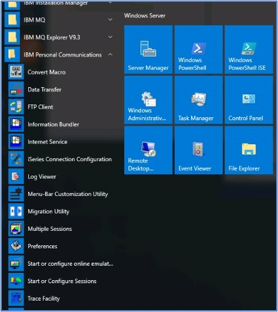
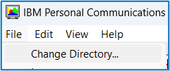
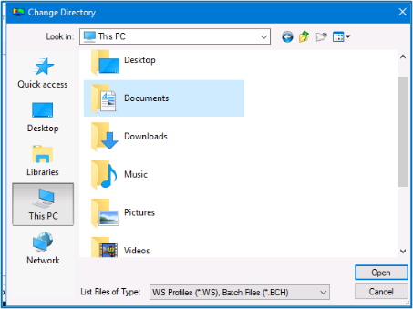
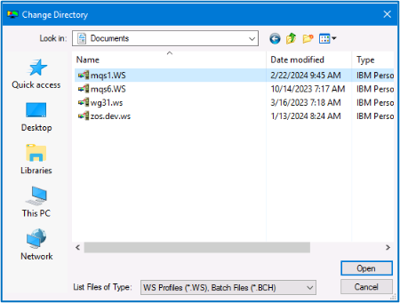

# Connecting to your z/OS Sysplex MQS1
#### Audience level
Some knowledge of MQ or z/OS 
#### Skillset
z/OS Systems Programming, MQ Administration
 
#### Introduction 
This lab is designed to connect the user to the Sysplex they have been assigned.  It will cover a couple of different connections (PCOMM, MQ Explorer) and some basic queue manager commands. 

#### Lab Steps

1)	If you have not already done so, please connect to the browser instance you were assigned.  Note that your user ID is always Administrator and the password is associated with the unique URL.  

2)	Please look on the panel for a PCOMM connection symbol (  ) labeled ‘MQS1’ or ‘MQS2.’   If you do not see it, please follow these steps to get it added:
a.	From the Windows programs, please expand the IBM Personal Communications group and select ‘Start or Configure Sessions’ as shown here:

b.	Some of our Windows images do not have the correct directory for PCOMM sessions.  If the Session Manager pane comes up empty, please change the directory that PCOMM uses. 

i.	In the upper left had corner of the Session manager pane, please chose ‘File’ then Change Directory 

ii.	Select the Documents directory

    
iii.	If you see the MQS1 ‘WS’ file, please click on ‘Open’ as shown. 

    
iv.	IF you do not see the ‘mqs1.WS’ file, please notify Dorothy or Lyn immediately.  We may need to reset your image. 

v.	If you do see the file, after clicking on Open, your ‘Session Manager’ pane should look something like this:

 
c.	Highlight ‘mqs1’ and click on the ‘Start’ button.

3)	If you do see the ‘mqs1’ icon, please click on it.

4)	At this point the WSC MQPLEX1 should be shown.  It may take a minute or so to connect. 
 
5)	Enter ‘mqs1 user1’ and press the enter key (note it may be the right hand ‘ctrl’ key or the actual enter key depending on your keyboard map.  If you would like to change the enter key and do not know how to alter your keyboard, please ask Dorothy or Lyn for assistance. 

6)	At this point you should see the TSO logon screen.  Please use the enter key to take you to the ISPF manu.

7)	The menu looks as follows:

8)	You have now successfully connected to the Sysplex LPAR MQS1!  

9)	Check to see if the queue manager is running:
a.	On the ‘Option’ line, please enter 13 to navigate to the z/OS User panel.
b.	Then enter ‘14’ to select SDSF

 

c.	From the SDSF menu, please select DA and as a convenience change the ‘scroll’ value from Page to CSR (cursor position) as shown.

 

d.	Enter the command ‘f ZSQ1’ to search for the queue manager as shown:

 

e.	If the response is  , then the queue manager is not started yet.  
f.	To start the queue manager, enter the start command as shown:
 
Note that the command prefix for our queue managers is the queue manager name only, we don’t use special characters for these. 
g.	You should bet a ‘NO RESPONSE RECEIVED’ replay, then do a search for ZQS1 again.

h.	The started queue manager should then show up in the ‘Active Users’ list, as seen here: 
 

i.	Next, start the channel initiator address space by entering 
 \
The response should be: 
 

j.	Using the enter key, the CHIN should now show up in the active users list:

 

10)	Now that the queue manager and channel initiator have started, it is time to connect the MQ Explorer to the queue manager.  Return to the windows image, Click on the  MQ Explorer as shown here: 

 

11)	The MQ Explorer panel should look something like this:

 

12)	Notice that there is no entry for ZQS1, so we need to add a connection to that queue manager.  To do this, right click on the Queue Managers folder and select ‘Add remote queue manager.’
13)	The ‘Add queue manager’ pane should appear.  Please fill in the queue manager name ZQS1 – CASE MATTERS! Then please click on the Next button.

 

14)	On the Specify new connection details panel, enter the host name as clone1mqs1 and the port number as 1424 as shown.  Please then click on the ‘Finish’ button.  

 
The name clone1mqs1 has been created in the etc hosts file for convenience.  

IF you have trouble connecting, please ask Dorothy and Lyn for assistance.  

15)	The queue managers panel is displayed showing the new queue manager, and a new folder for the Queue Sharing Group.  Expanding that folder will show the queue sharing group resources.  

 

Congratulations!  Your Windows image is now fully connected to the back end Sysplex. 

