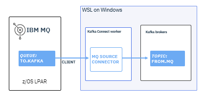

# Connecting IBM MQ for z/OS to Kafka as a client

#### **Audience level**
Knowledge of IBM MQ for z/OS or Linux
#### **Skill set**
Kafka, IBM MQ for z/OS

#### **Background**

This lab is designed for MQ administrators looking to gain beginner experience with Apache Kafka. If you are looking to gain familiarity with connecting IBM MQ for z/OS to Kafka for event-streaming, this lab is a great place to start. In this lab, we will walk through configuring the open-source Kafka Connector to demonstrate how to capture z/OS events with a standalone Kafka instance. Businesses are looking to capture the valuable insights on z/OS with events, using Kafka. As an MQ administrator, this lab will help you become comfortable with the Kafka architecture. This lab is for development and test purposes only.

If you have a license for IBM MQ for z/OS Advanced or Advanced VUE or IBM Event Streams, you have fully supported access to the MQ-Kafka connectors. 

#### High-level architecture



#### Pre-requisities
1. Java running on Windows Subsystem for Linux
    
    ```
    openjdk version "21.0.6" 2025-01-21
    OpenJDK Runtime Environment (build 21.0.6+7-Ubuntu-122.04.1)
    OpenJDK 64-Bit Server VM (build 21.0.6+7-Ubuntu-122.04.1, mixed mode, sharing)
    ```

2. Apache Maven running on Windows Subsystem for Linux

    ```
    Apache Maven 3.6.3
    Maven home: /usr/share/maven
    Java version: 21.0.6, vendor: Ubuntu, runtime: /usr/lib/jvm/java-21-openjdk-amd64
    Default locale: en, platform encoding: UTF-8
    OS name: "linux", version: "5.15.167.4-microsoft-standard-wsl2", arch: "amd64", family: "unix"
    ```

3. Apache Kafka downloaded from [here](https://kafka.apache.org/downloads) in binary format from (I am using kafka_2.13-3.9.0)

4. IBM MQ for z/OS. I am using IBM MQ version 9.4. You must use a version of MQ beyond v.8.

### Lab Overview

I. Configure MQ objects
II. Prepare your Kafka server and topic
II. Run the MQ-Kafka source connector
III. Send messages from MQ to Kafka
IV. Stopping Apache Kafka

### Lab Begin

### I. Configure your MQ objects

In this step, we will create the necessary MQ objects to send messages from MQ to our Kafka client.

1. In order to send messages from MQ to Kafka, we need to set up a queue and a channel on MQ. On the MQ Web Console or MQ Explorer, create a local queue called KAFKA.QUEUE.

2. On the MQ Web Console or MQ Explorer, create a server-connection channel called KAFKA.SVRCONN.


### II. Prepare your Kafka server and topic

In this step, we will start the Kafka server and create our first topic. 

1\. Navigate to your linux distro on your local machine. This example assumes the use of Ubuntu.

2\. Start a ZooKeeper server:
    ``` shell
    bin/zookeeper-server-start.sh config/zookeeper.properties
    ```

    You will see a long list of messages, including the Zookeeper logo. 

3\. In another terminal, start a Kafka server:
    ``` shell
    bin/kafka-server-start.sh config/server.properties
    ```

    You will see a long list of messages.

4\. In a third terminal window, create a topic called `TSOURCE` for the connector to send events to:
    ``` shell
    bin/kafka-topics.sh --zookeeper localhost:2181  --create --topic TSOURCE --partitions 1 --replication-factor 1
    ```

5\. At this point, you have a Kafka cluster consisting of a single node.

The configuration is as follows:
* Kafka bootstrap server - `localhost:9092`
* ZooKeeper server - `localhost:2181`
* Topic name - `TSOURCE`

**Note:** This configuration of Kafka puts its data in `/tmp/kafka-logs`, while ZooKeeper uses `/tmp/zookeeper` and Kafka Connect uses `/tmp/connect.offsets`. You can clear out these directories to reset to an empty state, making sure beforehand that they're not being used for something else. Use kafka-logs to navigate error-handling

### III. Running the MQ source connector
The MQ source connector takes messages from an MQ queue and transfers them to a Kafka topic.

1\. In a directory of your choice, clone and build the connector:

```shell
git clone https://github.com/ibm-messaging/kafka-connect-mq-source.git
cd kafka-connect-mq-source
mvn clean package
```

Going forward, we'll refer to the top-level directory you used to build the connector as the *connector root directory*.

2\. In a terminal window, change directory into the connector root directory and copy the sample connector configuration file into your home directory so you can edit it safely:
    ``` shell
    cp config/mq-source.properties ~
    ```

3\. Edit the following properties in the `~/kafka-connect-mq-source/mq-source.properties` file to match the configuration so far:
   ```
   topic=TSOURCE
   mq.queue.manager=ZQS1
   mq.connection.name.list=localhost(1414)
   mq.channel.name=KAFKA.SVRCONN
   mq.queue=KAFKA.QUEUE
   ```

4\. You will also have to modify `/config/connect-standalone.properties` in your Kafka root directory. The last line should reflect the location of your connector root directory.
    ```
    plugin.path=~/kafka-connect-mq-source
    ```

**Note:** You may notice here the use of one queue manager could inhibit high availability. This is because we are running the connector in standalone mode. To achieve higher availability, you would either want to use shared queues in your MQ configuration or run the connector in distributed mode. Distributed mode is beyond the scope of this tutorial.

4\. Change directory to the Kafka root directory. Start the connector worker replacing `<connector-root-directory>` and `<version>` with your directory and the connector version:

    ``` shell
    CLASSPATH=<connector-root-directory>/target/kafka-connect-mq-source-<version>-jar-with-dependencies.jar bin/connect-standalone.sh config/connect-standalone.properties ~/mq-source.properties
    ```

    The log output will include the following messages that indicate the connector worker has started and successfully connected to IBM MQ:

    ```
    INFO Created connector mq-source
    INFO Connection to MQ established
    ```

**Note:** We are running our connector in standalone mode here for simplicity. 

5\. Once the connector has started successfully and connected to MQ, you'll see this message:

```
INFO Connection to MQ established
```

You should also be able to see your KAFKA.QUEUE on MQ with the open input field as 1. 

### IV. Send messages from MQ to Kafka

1\. In a new terminal window, use the Kafka console consumer to start consuming messages from your topic and print them to the console:
``` shell
bin/kafka-console-consumer.sh --bootstrap-server localhost:9092 --topic TSOURCE
```

2\. Now, from either the MQ Web Console or MQ Explorer, go ahead and put some test messages on your queue. After a short delay, you should see the messages printed by the Kafka console consumer.

Congratulations! The messages were transferred from the MQ queue `KAFKA.QUEUE` onto the Kafka topic `TSOURCE`.

### v. Stopping Apache Kafka

To shut down your work cleanly, in the Kafka root directory, stop Kafka and ZooKeeper:

``` shell
bin/kafka-server-stop.sh
bin/zookeeper-server-stop.sh
```

**Note:** Make sure Kafka is fully stopped before stopping ZooKeeper.

### What could go wrong? Error handling

- You may have to alter the defaults in config/server.properties. The location of your log should reflect a useful path for your own environment. As an example:  

    ```
    # A comma separated list of directories under which to store log files
    log.dirs=/mnt/c/kafka-logs
    ``` 

- If something goes wrong, you'll see familiar MQ reason codes in the error messages to help you diagnose the problems, such as:

    ```
    ERROR MQ error: CompCode 2, Reason 2538 MQRC_HOST_NOT_AVAILABLE
    ```

    You can just kill the worker, fix the problem and start it up again.

### Conclusion

Congratulations! You have now tested a simple example of running MQ and Kafka together using the source connector send messages from the direction of z/OS to Kafka. While client mode is a easy way to get started, running the kafka connector in bindings mode is optimal due the improved CPU consumption and latency. Additionally, because the kafka connector is written in java, it is zIIP eligible.

Acknowledgements: MQ Development team

