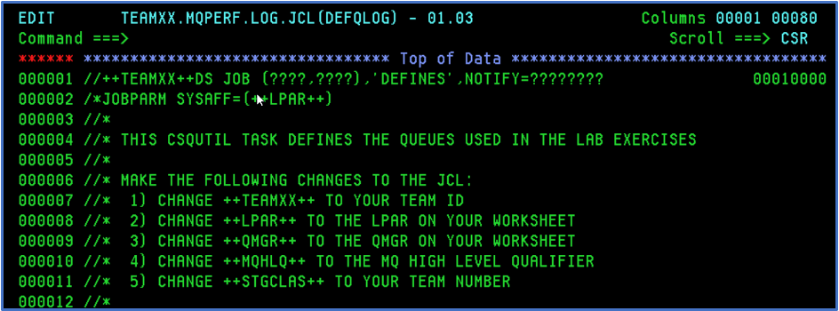
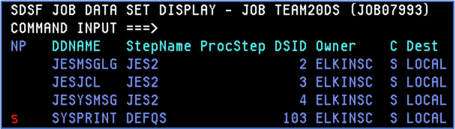
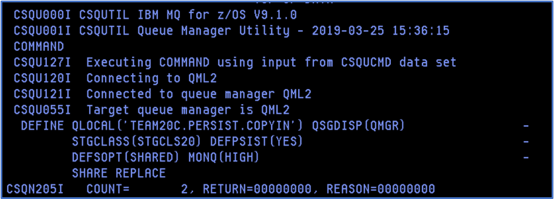
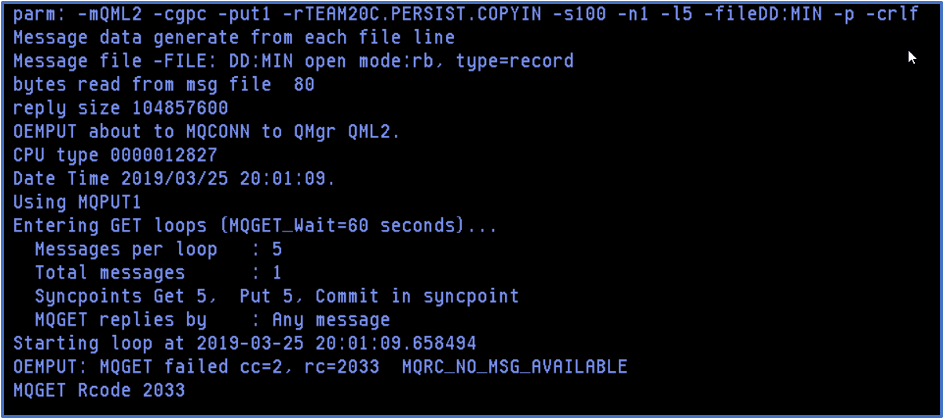
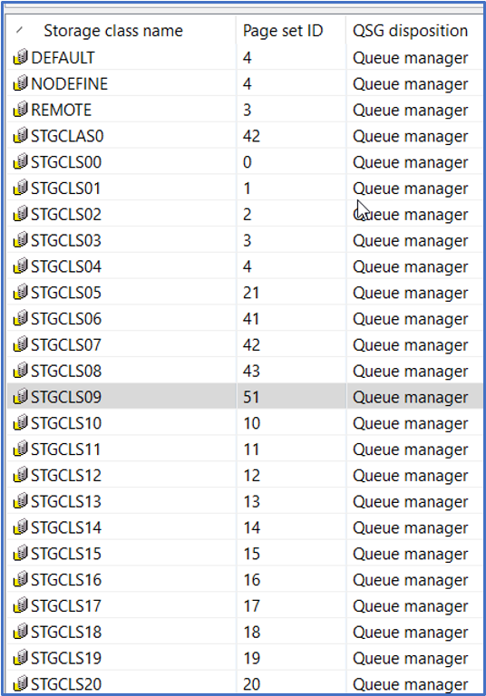
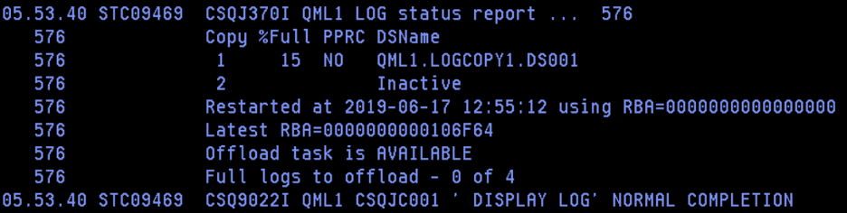
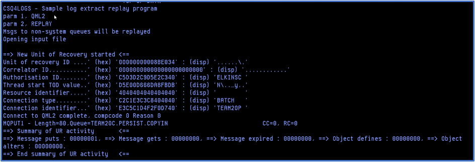

# Replaying a persistent message from log

#### **Audience level**
Beginner; Some knowledge of MQ or z/OS 

#### **Skillset**
MQ Administration, z/OS systems programming

#### **Background**
Recovery logs are a critical component of resiliency of IBM MQ for z/OS. Administrators can use the CSQ1LOGP and CSQ4LOGS utilities to analyze relevant portions of the MQ log. CSQ1LOGP and CSQ4LOGS are included with the MQ for z/OS product.

### **Overview of exercise**

This lab is to demonstrate using the provided utilities to replay a persistent message from the queue manager log. It will employ CSQUTIL to create a queue, use OEMPUT to put a single persistent message, use the MQ Explorer to look at the message, OEMPUT to get the message from the queue, CSQ1LOGP to extract the message based on the pageset used, CSQ4LOGS to replay the message, and the same module to do an activity summary. 

Lab Steps

1)	 In the TEAMXX.MQPERF.LOG.JCL PDS (where the TEAMXX is your TEAM ID), select the  DEFQLOG member.  This job defines two queues that will be used in the jobs that follow.

2)	Using a change all command, alter the ‘++’ variables as listed in the JCL comments:

CHANGE ++TEAMXX++ TO YOUR TEAM ID            
CHANGE ++LPAR++ TO THE LPAR ON YOUR WORKSHEET   
CHANGE ++QMGR++ TO THE QMGR ON YOUR WORKSHEET   
CHANGE ++MQHLQ++ TO THE MQ HIGH LEVEL QUALIFIER 
CHANGE ++STGCLAS++ TO YOUR TEAM NUMBER  

NOTE:  The MQHLQ is MQ910.  The STGCLAS may be different from the pageset ID, which will be used later to isolate the message(s) to extract and replay.  

3)	After the changes the statements should looks something like this (TEAM20 used as an example)

CHANGE TEAM20 TO YOUR TEAM ID              
CHANGE MPX2 TO THE LPAR ON YOUR WORKSHEET   
CHANGE QML2 TO THE QMGR ON YOUR WORKSHEET   
CHANGE MQ910 TO THE MQ HIGH LEVEL QUALIFIER 
CHANGE 20 TO YOUR TEAM NUMBER               
        

4)	Save and submit the job. 
5)	Navigate to SDSF.ST to review the results.  
 
6)	Select the job, using the question mark to display the list of files:

7)	Select it as shown. The output should indicate success – this is important to check, as there are times when the job will receive a zero return code, but the queue has not actually been created.  The output should look like this:

 

8)	Return to the JCL PDS and select the LOGPUT member.  
9)	Using a change all command, alter the ‘++’ variables as listed in the JCL comments:

CHANGE ++TEAMXX++ TO YOUR TEAM ID            
CHANGE ++LPAR++ TO THE LPAR ON YOUR WORKSHEET   
CHANGE ++QMGR++ TO THE QMGR ON YOUR WORKSHEET   
CHANGE ++MQHLQ++ TO THE MQ HIGH LEVEL QUALIFIER

10)	After the changes the statements should looks something like this (TEAM20 used as an example)

CHANGE TEAM20C TO YOUR TEAM ID              
CHANGE MPX2 TO THE LPAR ON YOUR WORKSHEET   
CHANGE QML2 TO THE QMGR ON YOUR WORKSHEET   
CHANGE MQ910 TO THE MQ HIGH LEVEL QUALIFIER 
11)	Save and submit the JCL.
12)	Navigating to the output, using the SDSF.ST option, the SYSPRINT output should look something like the example shown here:  

13)	Open the MQ Explorer, if the you do not see the queue managers QML1 or QML2 please go to the Appendix to see how to add them to the list of available queue managers. 
14)	Browse the messages on the queue.  To browse the messages, right click on the queue name and select Browse Messages. 
 
15)	Right click on the message and select ‘Properties’ .  This should open the following panel:

 
16)	Select the ‘Identifiers’ tab and look at the message ID

17)	Using the scroll, move to the right displaying the remainder of the message identifier bytes. 

18)	Close the panel. 

19)	Returning to the JCL PDS, select the LOGGET member and make changes to the ‘++’ variables like the changes made to the LOGPUT member.  

20)	Save and submit the LOGGET job.   Note that this task will take slightly more than a minute to complete, as it defaults to a get wait of 60 seconds.  In addition it will return a 2033 reason code.  
 
21)	Navigating to the output, using the SDSF.ST option, the SYSPRINT output should look something like the example shown here:  

22)	Note that the total messages retrieved is 1.  Returning to the MQ Explorer, the current queue depth should now be zero.  

23)	At this point, you have now successfully put and gotten a persistent message. 

24)	Returning to the JCL PDS, select the LOGEXTR1 member.  This is an execution of the  CSQ1LOGP task.  Make the global changes to the ‘++’ variables, with the exception of the PAGESET and active log variables.

CHANGE ++PAGESET++ TO THE PAGESET NUMBER USED FOR THE QUEUE
CHANGE ++LOGNAME++ TO THE ACTIVE LOG WHERE THE MESSAGE WAS PUT

25)	To get the pageset number:
a.	From the MQ Explorer, display the storage classes.  It should look something like this:

 
b.	Match the name of the storage class used to the pageset ID.  In the example for the lab document, the pageset associated with STGCLS09 is ‘51’.
c.	Change the all instances of the  ++PAGESET++ variable to the pageset from this list. 

 
26)	To get the name of the active log data set, navigate to the SDSF.DA panel and alter the prefix to display the queue manager and channel initiator.  The command to do that is PREFIX QML* and the output should look something like this (example is for the MPX2 LPAR):

27)	Expand the MSTR output for your primary queue manager and select the JESMSGLG output.  The results should look something like what is shown: 

 

28)	Navigate to the bottom of the output using the ‘BOT’ command.
 
29)	Enter the command to display the active log, replacing the ‘+cpf’ with the queue manager name:

+cpf DISPLAY LOG

30)	At the end of the Display log report, the current active log is given.  In the case of QML1 at the time this was written, this looks as follows:

31)	The last node of the current log name is used to replace the ‘++LOGNAME++’ variable.  In this case the value is DS001.  

32)	Change all instances of the ++LOGNAME++ to the value above.  Save and submit the LOGEXTR1 job.  This will extract all the updates made to the pageset.  Note that in a normal production environment this could include many messages for many queues.  The documentation for this may be found here:

https://www.ibm.com/support/knowledgecenter/en/SSFKSJ_9.1.0/com.ibm.mq.ref.adm.doc/q088970_.htm 

 
33)	The start of the output from this job should look as follows:

NOTE:  The pageset in the ‘SEARCH CRITERIA’ section is the hex value for the pageset.  

34)	Scrolling thru the output, you should be able to see the message much like what is shown here:

35)	Return to the JCL PDS and select the LOGJ member.  This executes the sample program CSQ4LOGS to replay the message(s) from the file created by the log extract process.  

36)	Alter the ‘++’ variables as done for the previous jobs.  Save and submit the job.  

37)	The output, in SYSPRINT, gives a description of the actions taken.  In this case, the start should look something like this:

38)	In addition, the queue depth should be back to 1 and browsing the queue should show the restored message.  

39)	Congratulations!  You have successfully restored a persistent message to a queue! 

-----------------------------------

 
Appendix – Adding Queue Managers to the MQ Explorer

1)	Right click on the ‘Queue Managers’ folder and select ‘Add Remote Queue Manager’ 

 

2)	Enter QML1 (we will add both queue managers used) and select ‘Connect directly’. Then click on the ‘Next’ button (not shown, but it’s on the bottom of the panel). 

 
3)	Enter ‘mpx1’ for the Host name or IP address and 1417 as the port number.  Then click on the ‘Finish’ button. 

4)	Repeat the steps for QML2, using mpx2 as the host name and 1418 as the port.  
 
5)	The Queue Manager list should now include both the z/OS queue managers used for this lab.

