# Replaying a Persistent Message from the Log

#### **Audience level**
Beginner; some knowledge of MQ or z/OS

#### **Skill set**
MQ Administration, z/OS systems programming

#### **Background**
Recovery logs are a critical part of IBM MQ for z/OS resiliency. Administrators can use the supplied utilities `CSQ1LOGP` and `CSQ4LOGS` to analyze relevant parts of the MQ log and, in some situations, replay logged activity.

This lab demonstrates how to replay a persistent message from the queue manager log. It uses `CSQUTIL` to create queues, `OEMPUT` to put a single persistent message, MQ Explorer to inspect the message, `OEMPUT` again to get the message from the queue, `CSQ1LOGP` to extract the relevant log records based on the page set, and `CSQ4LOGS` to replay the message. It also uses the same utility to produce a summary of activity.

### **Overview of the exercise**

In this lab, you will:

1. Define the queues used by the exercise
2. Put a persistent message to the queue
3. Browse the message in MQ Explorer and inspect its message ID
4. Get the message from the queue
5. Identify the page set and active log used when the message was written
6. Extract the relevant log records with `CSQ1LOGP`
7. Replay the message with `CSQ4LOGS`
8. Verify that the message is restored to the queue

### Prerequisites

Before you begin, make sure you have the following:

- Your assigned team ID, for example `TEAM20`
- The correct LPAR name from your workshop worksheet
- The correct queue manager name from your workshop worksheet
- Access to the `TEAMXX.MQPERF.LOG.JCL` PDS for your team
- Authority to submit jobs and review output in SDSF
- MQ Explorer access to the target queue manager
- The MQ high-level qualifier used in your environment
- The storage class or team storage value required by the JCL
- Permission to browse queue manager logs and JES output

> Note: This lab is workshop-specific. Values such as `TEAMXX`, queue manager names, LPAR names, `MQHLQ`, and storage class values must be replaced with the ones assigned to your environment.

> Note: This exercise is based on a **persistent** message. Nonpersistent messages are not handled the same way for recovery purposes, so make sure the put step uses persistence.

### Lab steps

#### I. Define the queues for the lab

1. In the `TEAMXX.MQPERF.LOG.JCL` PDS, where `TEAMXX` is your assigned team ID, select the `DEFQLOG` member. This job defines the queues that are used later in the lab.

   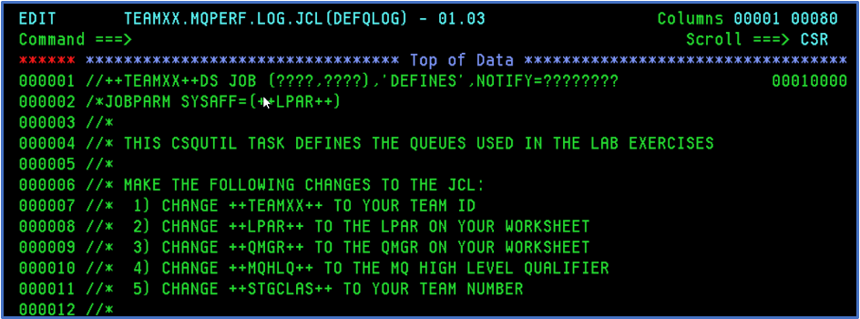

2. Use a global change command to replace the `++...++` variables as described in the JCL comments:

   ```text
   CHANGE ++TEAMXX++ TO YOUR TEAM ID
   CHANGE ++LPAR++   TO THE LPAR ON YOUR WORKSHEET
   CHANGE ++QMGR++   TO THE QMGR ON YOUR WORKSHEET
   CHANGE ++MQHLQ++  TO THE MQ HIGH LEVEL QUALIFIER
   CHANGE ++STGCLAS++ TO YOUR TEAM NUMBER
   ```

   > Note: The `MQHLQ` value shown in the original lab is `MQ910`, but that is environment-specific and may not be current in your lab environment.

3. After the changes, the statements should look similar to the following example:

   ```text
   CHANGE TEAM20 TO YOUR TEAM ID
   CHANGE MPX2   TO THE LPAR ON YOUR WORKSHEET
   CHANGE QML2   TO THE QMGR ON YOUR WORKSHEET
   CHANGE MQ910  TO THE MQ HIGH LEVEL QUALIFIER
   CHANGE 20     TO YOUR TEAM NUMBER
   ```

4. Save and submit the job.

5. Navigate to `SDSF.ST` to review the results.

6. Select the job and use the question mark to display the list of output files.

   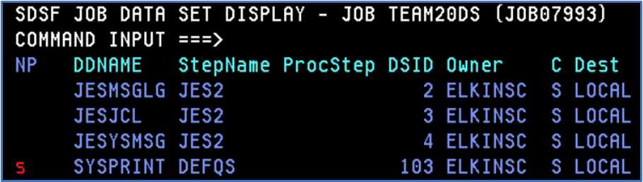

7. Open the relevant output. Confirm that the queues were actually created successfully. This is important because, in some cases, the job can end with return code zero even though the queue definitions were not applied as expected.

   The output should look similar to this:

   

#### II. Put a persistent message

8. Return to the JCL PDS and select the `LOGPUT` member.

9. Use a global change command to replace the `++...++` variables as described in the member comments:

   ```text
   CHANGE ++TEAMXX++ TO YOUR TEAM ID
   CHANGE ++LPAR++   TO THE LPAR ON YOUR WORKSHEET
   CHANGE ++QMGR++   TO THE QMGR ON YOUR WORKSHEET
   CHANGE ++MQHLQ++  TO THE MQ HIGH LEVEL QUALIFIER
   ```

10. After the changes, the statements should look similar to the following example:

   ```text
   CHANGE TEAM20 TO YOUR TEAM ID
   CHANGE MPX2   TO THE LPAR ON YOUR WORKSHEET
   CHANGE QML2   TO THE QMGR ON YOUR WORKSHEET
   CHANGE MQ910  TO THE MQ HIGH LEVEL QUALIFIER
   ```

   > Note: The earlier version of this lab showed `TEAM20C` in one example. That appears to be inconsistent and should be verified against the actual JCL member you are editing.

11. Save and submit the JCL.

12. Review the output in `SDSF.ST`. The `SYSPRINT` output should look similar to the following example:

   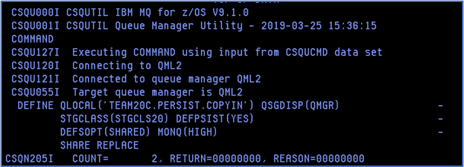

13. Open MQ Explorer. If you do not yet see queue managers such as `QML1` or `QML2`, use the appendix at the end of this lab to add them.

14. Browse the messages on the queue. Right-click the queue name and select **Browse Messages**.

15. Right-click the message and select **Properties**. This should open a panel like the following:

   

16. Select the **Identifiers** tab and view the message ID.

   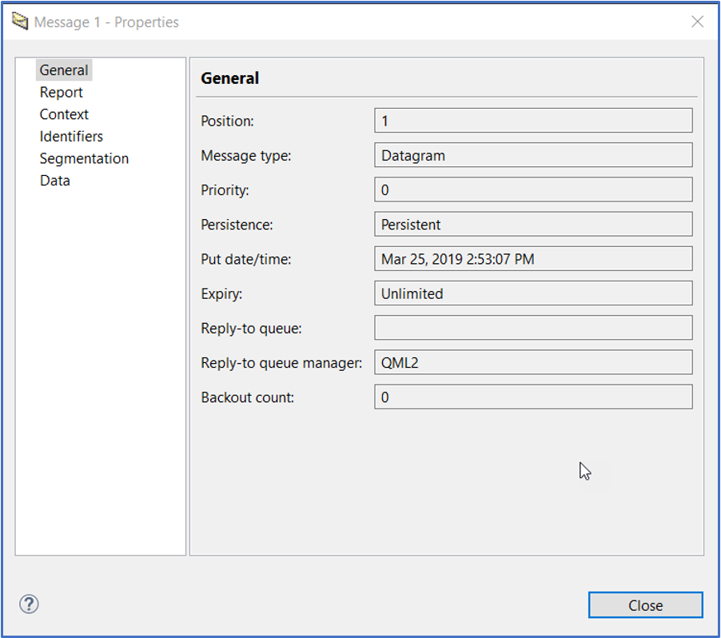

17. Scroll to the right to display the remaining message identifier bytes.

   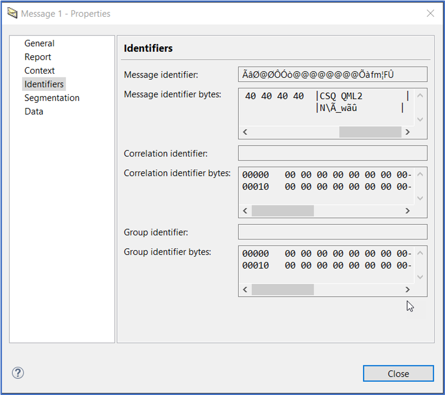

18. Close the panel.

#### III. Get the message from the queue

19. Return to the JCL PDS and select the `LOGGET` member. Make the same `++...++` substitutions you used for `LOGPUT`.

20. Save and submit the `LOGGET` job.

21. Note that this step may take slightly more than one minute to complete because it defaults to a wait interval of 60 seconds. It is also expected to return reason code `2033`.

   > Note: Reason code `2033` means `MQRC_NO_MSG_AVAILABLE`. In this lab, that is expected after the program successfully gets the single test message and then waits for another message that never arrives.

22. Review the output in `SDSF.ST`. The `SYSPRINT` output should look similar to the following example:

   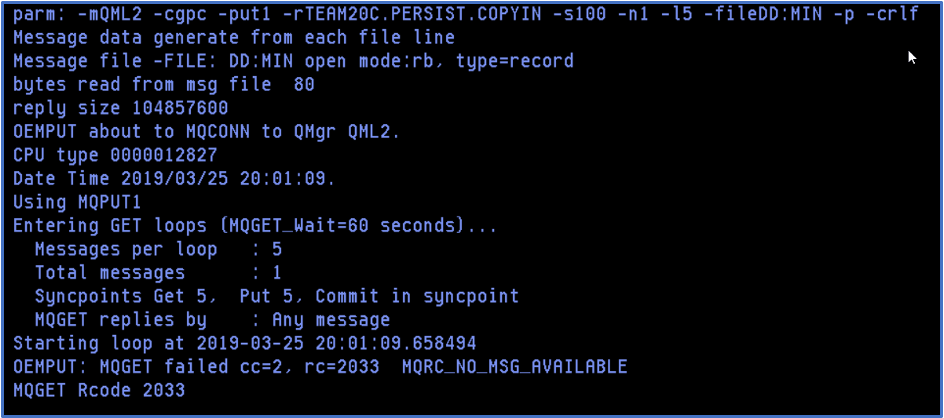

23. Confirm that the total number of messages retrieved is `1`. Return to MQ Explorer and verify that the current queue depth is now `0`.

24. At this point, you have successfully put and gotten a persistent message.

#### IV. Identify the page set and active log

25. Return to the JCL PDS and select the `LOGEXTR1` member. This job runs `CSQ1LOGP`.

26. Make the global changes to the `++...++` variables, but do not update `++PAGESET++` or `++LOGNAME++` until you have identified the correct values.

27. To determine the page set number:

   a. In MQ Explorer, display the storage classes. It should look similar to the following:

   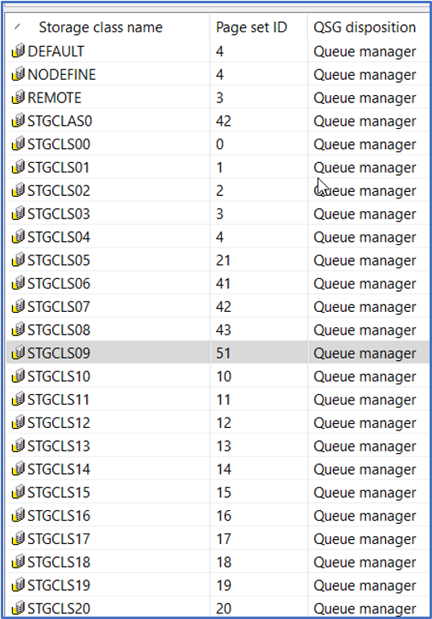

   b. Match the name of the storage class used by your queue to the page set ID. In the example shown in the original lab, the page set associated with `STGCLS09` is `51`.

   c. Replace all instances of `++PAGESET++` with the page set ID you identified.

28. To determine the name of the active log data set, navigate to `SDSF.DA` and set the prefix so that you can display the queue manager and channel initiator address spaces. For example:

   ```text
   PREFIX QML*
   ```

   The output should look similar to the following example:

   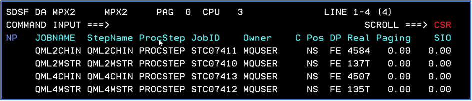

29. Expand the MSTR output for your queue manager and select the `JESMSGLG` output. The results should look similar to the following:

   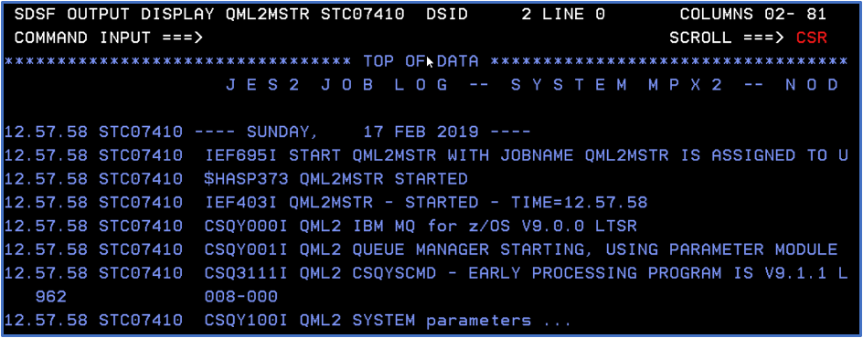

30. Navigate to the bottom of the output by using the `BOT` command.

31. Enter the command to display the log status, replacing the command prefix with your queue manager name if needed:

   ```text
   +cpf DISPLAY LOG
   ```

32. At the end of the display log report, identify the current active log. An example is shown below:

   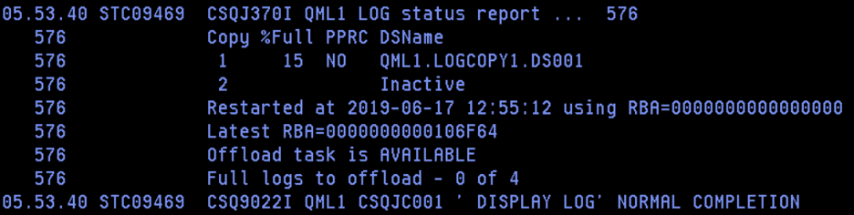

33. Use the last node of the current log name to replace the `++LOGNAME++` variable. In the example shown, that value is `DS001`.

   > Note: In a busy environment, active log datasets can switch over time. If too much time passes between the put step and the extraction step, verify that you are still selecting the correct active log for the message you wrote.

#### V. Extract the log records

34. Replace all instances of `++LOGNAME++` with the value you identified. Save and submit the `LOGEXTR1` job.

35. This job extracts updates made to the selected page set. In a production environment, that could include updates for many messages and many queues, not just the one used in this lab.

36. The IBM documentation for `CSQ1LOGP` should be referenced using the current IBM Docs site for your MQ version.

37. The beginning of the output should look similar to the following:

   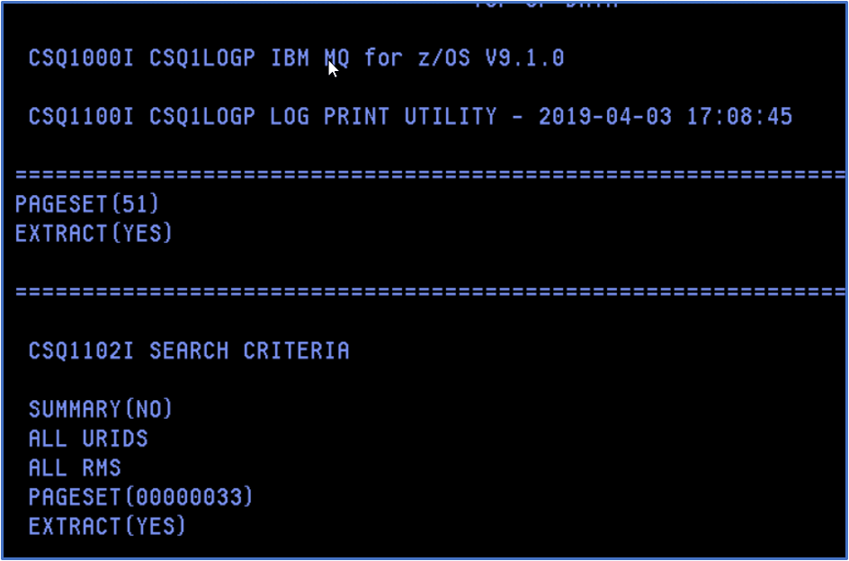

   > Note: In the **SEARCH CRITERIA** section, the page set is displayed in hexadecimal.

38. Scroll through the output and confirm that you can see the message data, similar to the following example:

   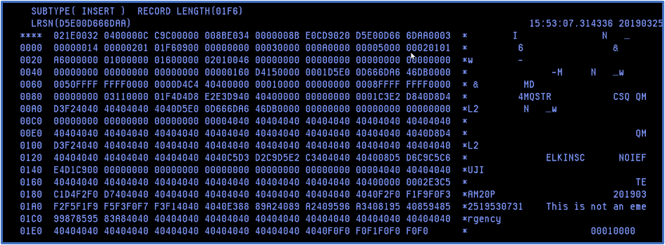

#### VI. Replay the message

39. Return to the JCL PDS and select the `LOGJ` member. This executes the sample program `CSQ4LOGS` to replay the message or messages from the file created by the log extraction process.

40. Replace the `++...++` variables in the same way as in the earlier jobs. Save and submit the job.

41. Review the `SYSPRINT` output. It should describe the replay actions taken and should look similar to the following:

   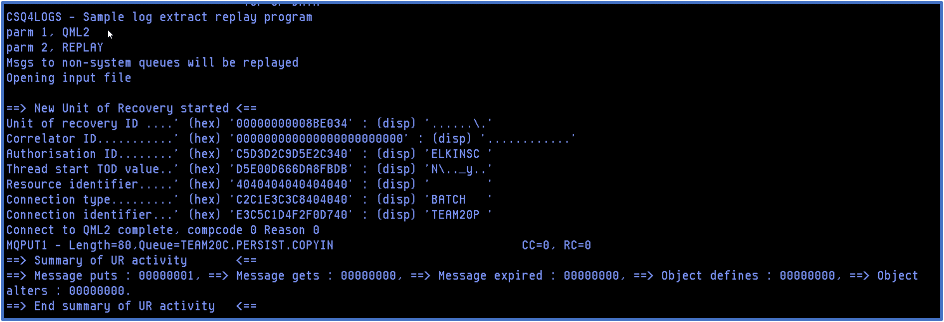

42. Return to MQ Explorer and verify that the queue depth is back to `1`.

43. Browse the queue and confirm that the message has been restored.

44. Congratulations. You have successfully restored a persistent message to a queue from the log.

### Validation checklist

Before considering the lab complete, verify the following:

- The queue definition job completed successfully and the queues were actually created
- `LOGPUT` successfully put one persistent message
- MQ Explorer showed the message and its message ID
- `LOGGET` removed the message and the queue depth became `0`
- The correct page set was identified for the queue
- The correct active log dataset was identified
- `CSQ1LOGP` output included the message data
- `CSQ4LOGS` replayed the extracted message successfully
- The queue depth returned to `1` after replay

### Troubleshooting

If the lab does not behave as expected, check the following:

- The `DEFQLOG` job really created the queues, even if the job return code was zero
- The `LOGPUT` job used persistence and wrote the message to the expected queue
- The `LOGGET` job was run against the same queue manager and queue
- The selected storage class maps to the correct page set
- The selected active log dataset is the one that contained the put operation
- Too much time did not pass between the put and extract steps, causing the relevant log records to move outside the expected active log
- `CSQ1LOGP` search criteria match the actual page set used by the queue
- MQ Explorer is connected to the correct queue manager
- The replay job completed successfully and wrote back to the expected queue

Common symptoms and causes:

- Queue depth is still `1` after `LOGGET`: the get job did not remove the message
- `LOGGET` returns `2033` immediately and no message was removed: the put job failed or the wrong queue was used
- `CSQ1LOGP` output does not show the message: wrong page set or wrong active log selected
- `CSQ4LOGS` runs but the queue remains empty: the extract file did not contain the target message or the replay criteria were wrong
- MQ Explorer does not show `QML1` or `QML2`: the queue managers have not yet been added to MQ Explorer

### Cleanup

If you want to clean up after the lab, delete the queues created by `DEFQLOG` using your normal MQ administration method, and confirm that the queue depths return to zero or that the objects are removed entirely.

If your workshop environment provides cleanup JCL, use that instead of deleting the queues manually.

### Appendix: Adding queue managers to MQ Explorer

1. Right-click the **Queue Managers** folder and select **Add Remote Queue Manager**.

   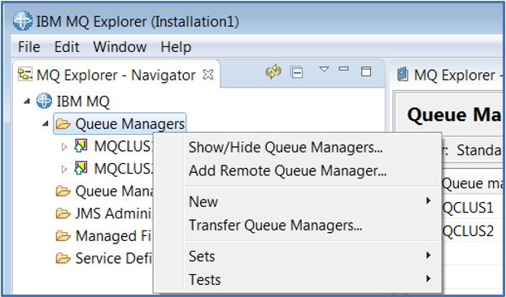

2. Enter `QML1` and select **Connect directly**. Then click **Next**.

   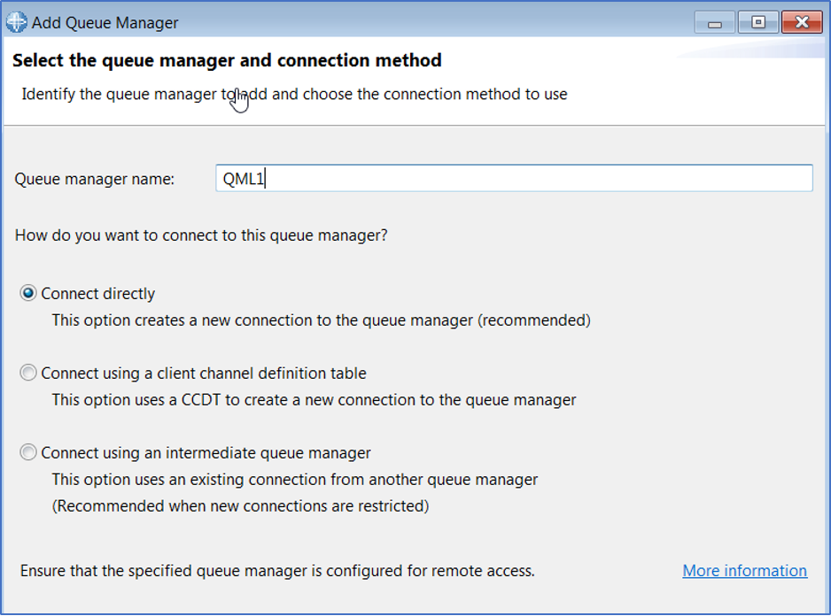

3. Enter `mpx1` for the host name or IP address and `1417` as the port number. Then click **Finish**.

   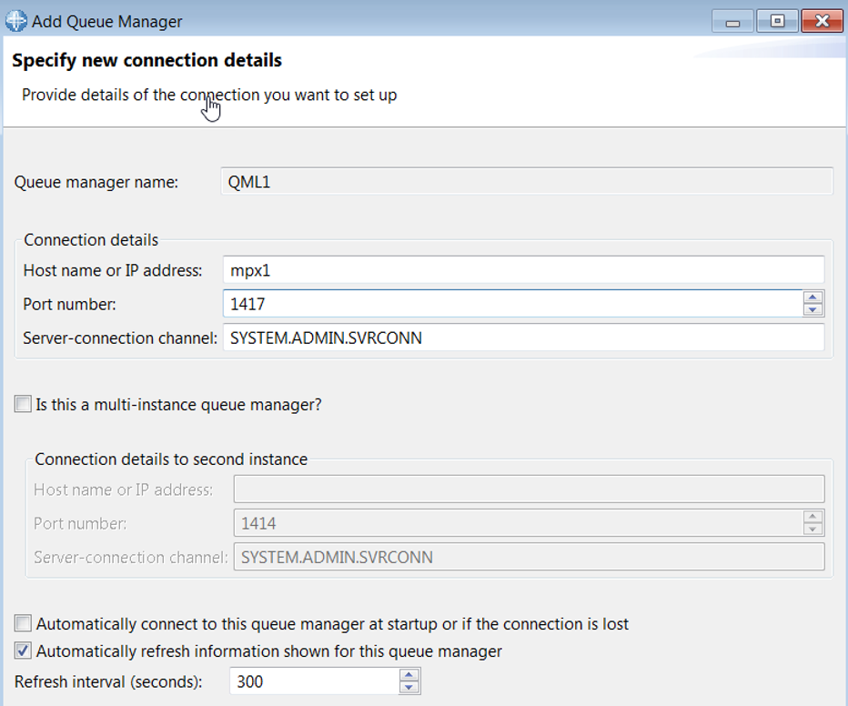

4. Repeat the steps for `QML2`, using `mpx2` as the host name and `1418` as the port.

5. The queue manager list should now include both z/OS queue managers used for this lab.

   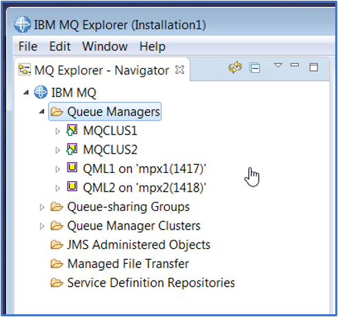
