# Looking at SMF Data for Problem Determination

#### **Audience level**
Some knowledge of MQ or z/OS

#### **Skillset**
MQ Administration, z/OS systems programming

#### **Background**
MP1B is a utility provided by IBM to help analyze IBM MQ for z/OS performance data. It reads MQ-related SMF records and can format them for review or export them to CSV for further analysis.

MP1B can be installed from IBM support resources. In this lab environment, it has already been installed for you.

Out of the box, MP1B contains:

- `MQCMD` - a program to display queue statistics and channel status over time
- `MQSMF` - a program for interpreting MQ accounting and statistics data
- `OEMPUT` - a program to put or get large volumes of messages, which is useful for throughput testing

### **Overview of the exercise**

In this lab, you will:

I. Set up the local queue `MP1B.TESTER`

II. Make sure the queue manager is configured to record the SMF data you need

III. Run JCL to generate and capture SMF data

IV. Navigate the formatted SMF output to identify a performance issue

V. Interpret the problem and relate it to the queue manager configuration

Video tutorial of the exercise: [Link](https://youtu.be/Mv4e50Xztn0)

### Prerequisites

Before you begin, make sure the following are available:

- Access to the `ZQS1.MP1B.JCL` data set
- A running queue manager `ZQS1`
- MQ Explorer access to `ZQS1`
- Authority to issue MQ commands and submit jobs through ISPF and SDSF
- Access to the MP1B sample jobs `OEMPUT`, `SMFDUMP`, and `MQSMFP`
- The correct Julian date for the day on which you run the lab
- Permission to alter queue manager attributes temporarily for the purpose of the exercise

> Note: This lab intentionally changes queue manager settings such as `STATIME`, `ACCTIME`, and `LOGLOAD` to produce visible effects in the SMF data. These values are suitable for a controlled lab, but not necessarily for a production environment.

### **Exercise**

#### I. Create the test queue

1. MP1B has already been installed in this environment. You can find it by searching for the data set `ZQS1.MP1B.JCL` in ISPF option `3.4`.

   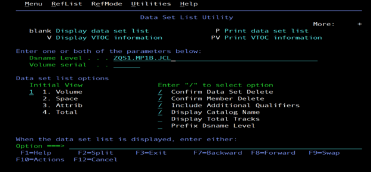

2. Open MQ Explorer on your Windows desktop.

   

3. In MQ Explorer, right-click the `ZQS1` queue manager and select **Connect**.

   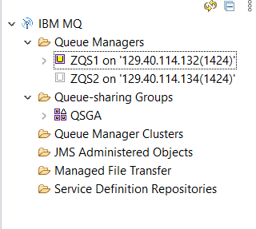

4. Expand `ZQS1`, right-click the **Queues** folder, and create a new local queue called `MP1B.TESTER`.

   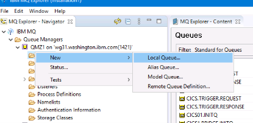

5. Create the queue with the properties shown in the following example:

   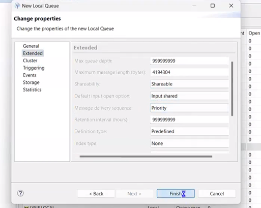

   > Why make the queue shareable? In a lab environment, shareable queues are convenient because multiple users or tools can browse them.

6. Once the queue has been defined, return to z/OS.

#### II. Configure the queue manager for SMF collection

7. You will now enter a series of MVS commands to adjust the queue manager configuration so that the resulting SMF data is easier to analyze.

8. From the ISPF main menu, enter `D` to open SDSF.

9. In SDSF, enter `/` in the command input line and press Enter to open the system command extension window.

10. A command prompt like the following should appear:

   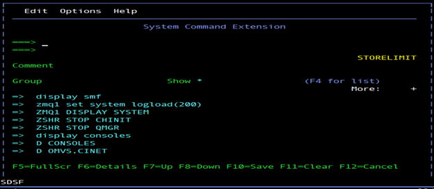

11. Enter the following commands one at a time. After each command, you may need to reopen the system command extension window with `/`.

   ```text
   ZQS1 SET SYSTEM STATIME(1.00)
   ```

   This changes the statistics interval to one minute.

   ```text
   ZQS1 SET SYSTEM ACCTIME(-1)
   ```

   This changes the accounting interval so that it follows the statistics interval.

   ```text
   ZQS1 SET SYSTEM LOGLOAD(200)
   ```

   This sets the `LOGLOAD` attribute to a very low value.

   > In this lab, `LOGLOAD(200)` is intentionally low so that the queue manager performs frequent checkpoints. This makes the effect visible in the SMF data.

   ```text
   DISPLAY SMF
   ```

   This shows where the SMF data is being recorded.

   ```text
   ZQS1 ALTER QMGR STATCHL(MEDIUM)
   ```

   This enables channel statistics collection at a moderate level.

   ```text
   ZQS1 ALTER QMGR MONQ(MEDIUM)
   ```

   This enables queue monitoring at a moderate level.

   ```text
   ZQS1 ALTER QMGR MONCHL(MEDIUM)
   ```

   This enables channel monitoring at a moderate level.

   ```text
   ZQS1 START TRACE(STAT) CLASS(1,2,4,5)
   ```

   ```text
   ZQS1 START TRACE(ACCTG) CLASS(3,4)
   ```

12. At this point, the queue manager should be configured to generate the SMF data needed for the exercise.

#### III. Generate workload and dump SMF data

13. Return to `ZQS1.MP1B.JCL` using ISPF option `3.4`.

14. Open the `OEMPUT` member by entering `E` next to it.

   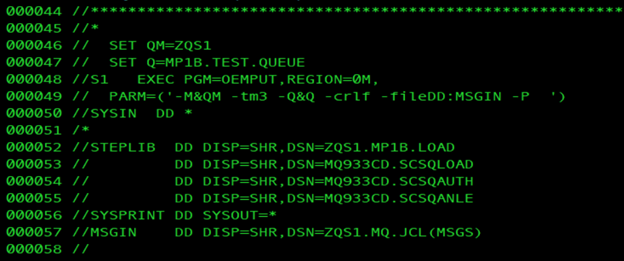

15. Verify that the queue manager name and queue name are correct in the member.

16. Submit the `OEMPUT` job to load persistent messages into the queue.

17. The following `PARM` line is especially important:

   ```text
   PARM=('-M&QM -tm3 -Q&Q -crlf -fileDD:MSGIN -P')
   ```

   Meaning of the parameters:

   | Parameter | Meaning |
   | --- | --- |
   | `-M&QM` | Queue manager name |
   | `-tm3` | Send messages for 3 minutes |
   | `-Q&Q` | Queue name |
   | `-crlf` | Use each input line as a separate message |
   | `-fileDD:MSGIN` | Use the `MSGIN` DD as input |
   | `-P` | Use persistent messages |

18. In MQ Explorer, you should now see that `MP1B.TESTER` is populated with many messages.

   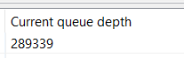

19. Back in `ZQS1.MP1B.JCL`, open the `SMFDUMP` member and submit it. This job deletes old output if needed and then writes the relevant SMF data to the target data set, which in this environment is `ZQS1.QUEUE.MQSMF.SHRSTRM2`.

   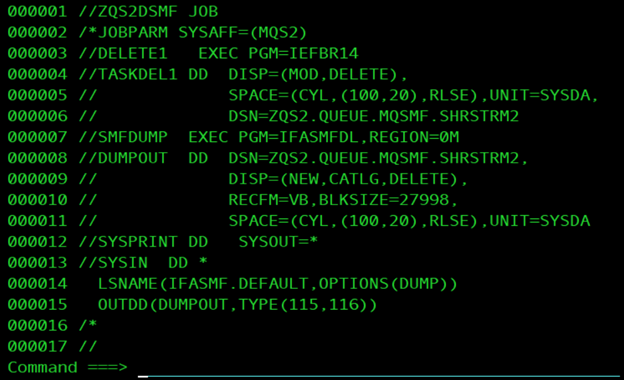

20. To confirm that `SMFDUMP` is processing, use SDSF. From ISPF, enter `=D`.

21. In SDSF, select `ST` and press Enter.

22. Enter the following command:

   ```text
   PREFIX ZQS1*
   ```

   This shows the submitted jobs that begin with `ZQS1`.

23. Place a `?` next to the job name and press Enter. Then place an `S` next to `SYSPRINT` and press Enter.

24. Enter `BOTTOM` on the command line. You should see output similar to the following, indicating that records are being written. You can also confirm this by locating the **SUMMARY ACTIVITY REPORT**.

   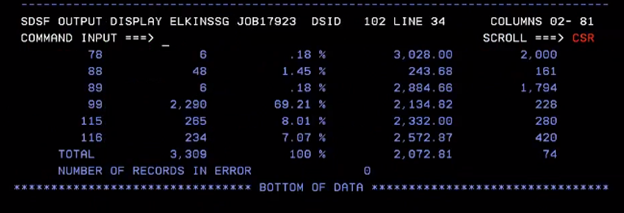

#### IV. Format and review the SMF data

25. After `SMFDUMP` completes, open the `MQSMFP` member in `ZQS1.MP1B.JCL`.

26. Before submitting the job, make sure the Julian date is correct for the day of the lab. For example, for 24 February 2025, the Julian date is `25055`.

27. Submit `MQSMFP`.

   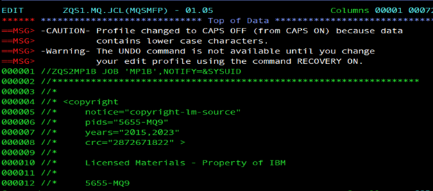

28. Navigate to the SDSF output for the submitted job. This output presents the SMF data in useful categories and can also be used to generate CSV-style output for later analysis.

   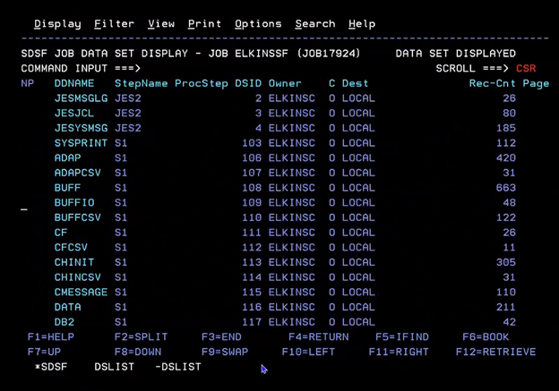

29. Select the **LOG statistics** section by placing an `S` next to it and pressing Enter.

30. Scroll until you see a screen similar to the following:

   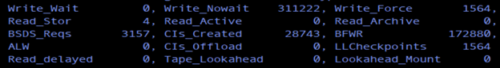

31. Review the `LLCheckpoints` value. In the lab example, it is `1564`. For such a short interval, that is extremely high. In a more typical interval, you would expect the value to be zero or a small single-digit number.

32. This result indicates that the queue manager is checkpointing far too frequently. In this lab, that behavior is caused by the intentionally low `LOGLOAD` setting.

#### V. Interpret the performance issue

33. The `LOGLOAD` parameter specifies how many log records are written between checkpoints.

   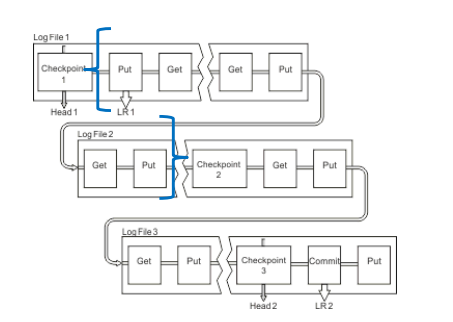

34. In the diagram above, the `LOGLOAD` interval is shown by the blue brackets. In a real environment, a value as low as the one shown in the illustration would be unrealistically small.

35. In this lab, you set the queue manager `LOGLOAD` attribute to the minimum value of `200` and then generated a heavy message workload. That combination caused a very high checkpoint frequency in the SMF window.

36. Excessive checkpointing increases processor usage and I/O activity. The performance conclusion for this lab is that `LOGLOAD(200)` is too low for the workload you generated.

### Validation checklist

Before considering the lab complete, confirm the following:

- `MP1B.TESTER` was created successfully
- The queue manager settings were changed successfully
- `OEMPUT` loaded persistent messages to the queue
- `SMFDUMP` captured the relevant SMF data
- `MQSMFP` formatted the SMF data successfully
- The `LOG statistics` section showed the `LLCheckpoints` value
- You were able to relate the high checkpoint count to the low `LOGLOAD` value

### Troubleshooting

If the lab does not work as expected, check the following:

- MQ Explorer is connected to `ZQS1`
- `MP1B.TESTER` was created on the correct queue manager
- The `OEMPUT` member references the correct queue manager and queue
- `SMFDUMP` completed successfully and wrote records to the expected data set
- The Julian date in `MQSMFP` is correct
- The queue manager tracing and monitoring commands were accepted successfully
- The workload actually ran long enough to generate noticeable SMF data
- You are viewing the `LOG statistics` section, not a different section of the formatted report

Common symptoms and causes:

- Queue depth never increases: `OEMPUT` may have been pointed at the wrong queue or queue manager
- `SMFDUMP` shows little or no activity: tracing or monitoring may not have been enabled correctly
- `MQSMFP` output is empty or incomplete: the wrong Julian date may have been used
- `LLCheckpoints` is low: the workload may have been too small, or `LOGLOAD` was not changed successfully
- MQ Explorer cannot browse the queue: the queue may not have been created, or the queue manager is not connected

### Cleanup

This lab changes queue manager settings to values that are useful for demonstration but are not ideal for normal operation. After the lab, consider restoring the queue manager settings to your environment's normal values.

At a minimum, review and reset these attributes if needed:

```text
ZQS1 SET SYSTEM STATIME(...)
ZQS1 SET SYSTEM ACCTIME(...)
ZQS1 SET SYSTEM LOGLOAD(...)
ZQS1 ALTER QMGR STATCHL(...)
ZQS1 ALTER QMGR MONQ(...)
ZQS1 ALTER QMGR MONCHL(...)
```

You may also want to remove the `MP1B.TESTER` queue after the exercise if it is no longer needed.
