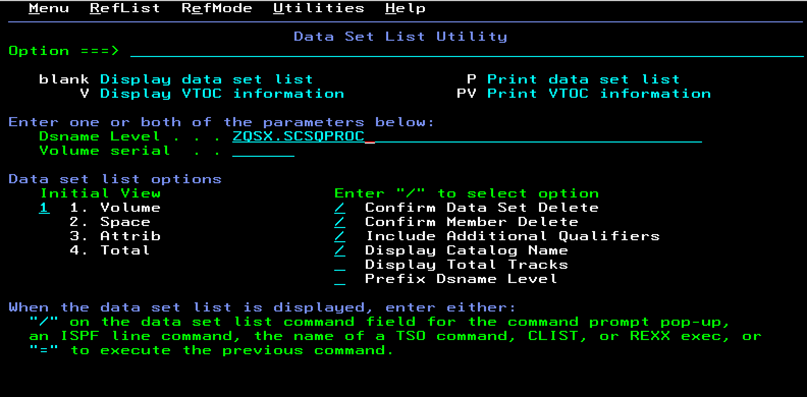

# Customizing a New Queue Manager on IBM MQ for z/OS

### Overview

This lab walks through the process of creating a new queue manager using IBM MQ for z/OS 9.4.2 CD (Continuous Delivery). IBM MQ for z/OS is assumed to be already installed in the lab environment, so the product installation itself is out of scope.

Understanding the manual creation process provides useful insight into:

- Architecture: how z/OS queue managers integrate with the operating system
- Performance tuning: the impact of page set and storage configuration
- Troubleshooting: what to check when a queue manager fails to start
- Automation: the foundation for repeatable provisioning and tools such as Ansible

### Prerequisites

You will need access to a sandbox z/OS system. If you are not able to access a sandbox z/OS environment, please reach out to IBM Worldwide Systems Center to provision a sample lab environment.

You should be familiar with IBM MQ for z/OS, ISPF/TSO, and SDSF.

The following needs to be installed or configured on z/OS:

   - IBM MQ for z/OS. We are using IBM MQ 9.4.5 continuous delivery in this tutorial, but the instructions should work all supported versions of IBM MQ for z/OS.
   - REXX EXEC called QMEDIT. The contents of the REXX EXEC are included in this document and may be tailored for different z/OS environments.

### Steps

In this lab, you will:

#### Step 1. Copy and tailor MQ sample JCL

#### Step 2. Run jobs to create the bootstrap data sets and page sets

#### Step 3. Add MSTR and CHIN procedures to SYS1.PROCLIB

#### Step 4. Dynamically add the MQ subsystem to MVS

#### Step 5. Define subsystem security

#### Step 6. Start the queue manager and channel initiator

### Step 1. Copy and tailor the sample JCL

1\. Copy the sample members from the IBM MQ installation library. In this environment, the MQ installation uses the high-level qualifier `MQ945CD`. You only need the sample members in `SCSQPROC`. From ISPF option `3.3`, copy all members from:

   ```
   MQ945CD.SCSQPROC(*)
   Option ===> C
   ```

2\. Use `ZQSX` as the high-level qualifier for the new queue manager library so the copied library becomes `ZQSX.SCSQPROC`.

3\. Type `1` next to option 1 so the new data set is allocated using the attributes of `MQ945CD.SCSQPROC`, then press Enter.

4\. Confirm that the members were copied successfully. You should see a message indicating that 113 members were copied into `ZQSX.SCSQPROC`.

5\. From the ISPF main screen, enter `=3.4` on the command line and navigate to the newly created data set.

   

6\. Press Enter, then browse the library by entering `B` next to the data set name.

7\. The following members must be customized to create a basic queue manager:

   | JCL member | Description |
   | --- | --- |
   | `CSQ4BSDS` | Creates bootstrap data sets |
   | `CSQ4CHIN` | Sample channel initiator procedure |
   | `CSQ4MSTR` | Sample queue manager procedure |
   | `CSQ4INPX` | Sample channel initiator commands |
   | `CSQ4INYG` | Commands to define commonly required objects |
   | `CSQ4PAGE` | Creates page sets |
   | `CSQ4ZPRM` | Creates queue manager initiation attributes |

8\. Locate `QMEDIT` in another queue manager `ZQS2.SCSQPROC`. From the ISPF main menu, go to option `3.3` and copy:

   - `ZQS2.SCSQPROC(QMEDIT)` to `ZQSX.SCSQPROC(QMEDIT)`

> NOTE: If you would like to manually customize the necessary MQ JCL, you do not have to use QMEDIT.

9\. Review the REXX EXEC to understand what it customizes. Because it was last used for another queue manager `ZQS2`, you will see `ZQS2` and older installation values throughout the member.

   The REXX EXEC allows you to make repeated substitutions across the sample members. For example:

   ```
   ISREDIT MACRO NOPROCESS
   ADDRESS ISREDIT
   /* **** UNIVERSAL CHANGES ****  */
   /* **** HIGH LEVEL QUALIFIER FOR THE WMQ LIBRARIES ****  */
   "change '++THLQUAL++' 'MQ933CD' all"
   /* **** LANGUAGE LETTER ****  */
   "change '++LANGLETTER++' 'E' all"
   /* **** HIGH LEVEL QUALIFIER FOR THE BSDS, LOGS, AND ****  */
   /* **** PAGE SETS                                    ****  */
   "change '++HLQ++' 'ZQS2' all"
   /* **** CSQ4BSDS CHANGES ****  */
   "change '++BSDSNAME++' 'MY.BSDS.DS' all"
   "change '++VOLBSDS1++' 'V1BSDS' all"
   "change '++VOLBSDS2++' 'V2BSDS' all"
   "change '++VOLLOG1A++' 'V1LOGA' all"
   "change '++VOLLOG1B++' 'V1LOGB' all"
   "change '++VOLLOG2A++' 'V1LOGC' all"
   "change '++VOLLOG2B++' 'V1LOGD' all"
   /* **** CSQ4CHIN CHANGES ****  */
   "change '++LEQUAL++' 'CEE' all"
   "change '++SSLQUAL++' 'SYS1' all"
   "change '++OUTCLASS++' '*' all"
   "change '++EXITLIB++' 'MY.EXITS' all"
   /* **** CSQ4INPX CHANGES ****  */
   "change '++port-number++' '1424' all"
   "change '++LOCALluname++' 'LUNAME' all"
   "change '++channel-name++' 'TEST.CHANNEL' all"
   /* **** CSQ4INYG CHANGES ****  */
   "change '++qmgr++'  'QMGR' all"
   /* **** CSQ4MSTR CHANGES ****  */
   "change '++OUTCLASS++' '*' all"
   "change '++EXITLIB++' 'MY.EXITS' all"
   "change '++LEQUAL++' 'CEE' all"
   "change '++DB2QUAL++' 'DB2V13' all"
   /* **** CSQ4PAGE CHANGES ****  */
   "change '++VOL0++' 'STORAGE' all"
   "change '++VOL1++' 'STORAGE' all"
   "change '++VOL2++' 'STORAGE' all"
   "change '++VOL3++' 'STORAGE' all"
   "change '++VOL4++' 'STORAGE' all"
   /* **** CSQ4ZPRM CHANGES ****  */
   "change '++NAME++'      'QMGRZPRM' all"
   ```

   Update the values in `QMEDIT` by issuing these ISPF change commands:

   a. Replace the existing queue manager qualifier:
   ```text
   C 'ZQS2' 'ZQSX' ALL
   ```

   b. Replace the MQ installation high-level qualifier:
   ```text
   C 'MQ933CD' 'MQ945CD' ALL
   ```

   c. Change the listener port to avoid conflict with `ZQS2`:
   ```text
   C '1424' '1425' ALL
   ```

10\. These updates tailor the REXX EXEC for this z/OS environment by setting the correct installation qualifier, queue manager name, and listener port.

11\. To activate `QMEDIT`, press `F3`, return to the ISPF main menu, select option `6`, and enter:

   ```text
   ALTLIB ACTIVATE APPLICATION(EXEC) DA('ZQSX.SCSQPROC')
   ```

12\. Press Enter. `ALTLIB` activates the REXX EXEC library so that `QMEDIT` can be run against the members you need to customize.

13\. Return to `ZQSX.SCSQPROC` through ISPF option `3.4`.

14\. Starting with `CSQ4BSDS`, edit each of the following members and run `QMEDIT` from the command line inside the member:

   - `CSQ4BSDS`
   - `CSQ4CHIN`
   - `CSQ4MSTR`
   - `CSQ4INPX`
   - `CSQ4INYG`
   - `CSQ4PAGE`
   - `CSQ4ZPRM`

15\. After you run `QMEDIT` in `CSQ4BSDS`, browse through the JCL using `F7` and `F8` to confirm the changes, then press `F3` to save and return to the member list.

   > NOTE: You must execute `QMEDIT` in the same session in which you ran the `ALTLIB` command. Otherwise, you will receive the message `QMEDIT not found`.

16\. Repeat the same process for the remaining members.

17\. Make an additional customization to `CSQ4PAGE`. Edit the member and issue the following commands:

   ```text
   C 'VOL=SER' 'STORCLAS' ALL
   ```

   ```text
   C 'VOLUMES' 'STORCLAS' ALL
   ```

   This changes the sample JCL from explicit volume usage to system-managed storage, which is the preferred approach in this environment.

18\. Save `CSQ4PAGE` with `F3`.

19\. Comment out lines 85 by placing `*` in the first column so they look like this:

   ```text
   000085 //*           DD DSN=++HLQ++.USERAUTH,DISP=SHR    
   ```

   > NOTE: Only do this in a lab environment. USERAUTH works with z/OS security manager to validate credentials against security profiles in MQQUEUE, MQPROC, and MQCONN classes, providing the first line of defense for queue manager security.

20\. Edit `CSQ4CHIN`, then enter `F USER EXIT LIBRARY` on the command line to locate the user exit library definitions.

21\. Comment out lines 94 and 119 by placing `*` in the first column so they look like this:

   ```text
   000094 //*          DD DSN=++CSFQUAL++.SCSSFMOD0,DISP=SHR
   ```

   ```text
   000119 //* CSQXLIB  DD DSN=++EXITLIB++.DISP=SHR
   ```

22\. Press `F3` to save `CSQ4CHIN` and return to the member list.

23\. Optionally, use `SORT CHANGED` from the member list panel to confirm which members were updated.

#### Step 2. Run jobs to create the bootstrap data sets and page sets

24\. Submit `CSQ4BSDS`. This creates the bootstrap data sets for the new queue manager.

25\. Submit `CSQ4PAGE`. This creates the page sets for the queue manager.

26\. Submit `CSQ4ZPRM`. This creates the queue manager initiation attributes.

27\. Return to the ISPF main menu and use option `3.4` to view all `ZQSX` libraries.

28\. Confirm that the new bootstrap and page set data sets now exist alongside `ZQSX.SCSQPROC`. If they do not, review the job output and compare your JCL with a known working queue manager such as `ZQS1`.

#### Step 3. Add MSTR and CHIN to SYS1.PROCLIB, the started task library

29\. Navigate to `SYS1.PROCLIB` using ISPF option `3.4`. You need two members for `ZQSX`: `ZQSXMSTR` and `ZQSXCHIN`.

30\. From the ISPF main menu, go to option `3.3` and copy:

   - `ZQSX.SCSQPROC(CSQ4MSTR)` to `SYS1.PROCLIB(ZQSXMSTR)`
   - `ZQSX.SCSQPROC(CSQ4CHIN)` to `SYS1.PROCLIB(ZQSXCHIN)`

31\. Return to `SYS1.PROCLIB` and verify that both `ZQSXMSTR` and `ZQSXCHIN` exist.

#### Step 4. Dynamically add MQ subsystem to MVS

32\. Open SDSF by entering `D` on the ISPF command line. In SDSF, enter a slash (`/`) in the command input area and press Enter.

   

33\. Dynamically define the MQ subsystem:

   ```text
   SETSSI ADD,S=ZQSX,I=CSQ3INI,P='CSQ3EPX,ZQSX,S'
   ```

   > NOTE: This dynamic definition does not survive an IPL. To make it permanent, you must update the appropriate `LPALST##`, `IEFSSN##`, and `PROG##` members in `SYS1.PARMLIB`.

#### Step 5. Define subsystem security

34\. Return to the ISPF main menu, select option `6`, and use the TSO command line to enter:

   ```text
   RDEFINE MQADMIN ZQSX.NO.SUBSYS.SECURITY
   ```

   > NOTE: Never disable subsystem security outside of a controlled lab or workshop environment.

35\. In this environment, the definition may already exist. The purpose of this step is to show how subsystem security was configured for the lab.

#### Step 6. Start the queue manager and channel initiator

36\. Return to SDSF and enter the following commands from the MVS command line:

   a. Start the queue manager:
   ```text
   ZQSX START QMGR
   ```

   b. Start the channel initiator:
   ```text
   ZQSX START CHINIT
   ```

   c. Start the listener:
   ```text
   ZQSX START LISTENER TRPTYPE(TCP) PORT(1425)
   ```

37\. To verify that the queue manager is working, check in SDSF that ZQSXMSTR and ZQSXCHIN are actively running in address spaces. Alternatively, connect to the queue manager using MQ Explorer or the MQ Web Console.

38\. Congratulations. You have created a queue manager from scratch!

### Appendix

- The `QMEDIT` REXX EXEC is not shipped as part of the base IBM MQ product. It is a convenience tool used in this lab to replace the `++variable++` placeholder values in the sample members.

- If you make a mistake when issuing the dynamic subsystem command, you can roll it back with:

  ```text
  SETSSI DELETE,S=ZQSX,FORCE
  ```

- To check APF-authorized libraries, enter `/DISPLAY PROG,APF` from SDSF and review the system log.

  Required APF-authorized libraries include:

  - `MQ945CD.SCSQANLE`
  - `MQ945CD.SCSQAUTH`
  - `MQ945CD.SCSQMVR1`

- You may see several `LPALST##`, `PROG##`, and `IEFSSN##` members. Use the members referenced by `SYS1.PARMLIB(IEASYS##)`. You can identify the active `IEASYS##` member with:

  ```text
  /D IPLINFO
  ```

  Example output:

  ```
  COMMAND INPUT ===>                                            S
  RESPONSE=MQS1
  IEE254I  09.34.43 IPLINFO DISPLAY 726
   SYSTEM IPLED AT 09.55.40 ON 03/10/2026
   RELEASE z/OS 03.02.00    LICENSE = z/OS
   USED LOADMQ IN SYS0.IPLPARM ON 0A04C
   ARCHLVL = 2   MTLSHARE = N
   VALIDATED BOOT: NO
   SOFTWARE INSTANCE UUID: bbb756c7-a3ea-40c4-b037-79a73b324536
   IEASYM LIST = XX
   IEASYS LIST = (00) (OP)
   IODF DEVICE: ORIGINAL(0A04C) CURRENT(0A04C)
   IPL DEVICE: ORIGINAL(0A472) CURRENT(0A472) VOLUME(Z32RD1)
   VM CPID = z/VM    7.3.0
   VM UUID IS NOT PROVIDED
   VM NAME = MQS1
   VM EXT NAME IS NOT PROVIDED
  ```

- To make the subsystem definition permanent, add an entry similar to the following to the active `IEFSSN##` member:

  ```text
  SUBSYS SUBNAME(ZQSX) INITRTN(CSQ3INI) INIPARM('CSQ3EPX,ZQSX,S')
  ```

- To make APF authorization permanent, add entries similar to the following to the active `PROG##` member:

  ```text
  APF ADD DSNAME(MQ945CD.SCSQ****) SMS
  ```

- To dynamically APF-authorize the MQ load libraries, use commands such as:

  ```text
  SETPROG APF,ADD,DSNAME=MQ945CD.SCSQANLE,SMS
  ```

  ```text
  SETPROG APF,ADD,DSNAME=MQ945CD.SCSQSNLE,SMS
  ```

- To dynamically add MQ modules to the LPA, use:

  ```text
  SETPROG LPA,ADD,MODNAME=(CSQ3EPX,CSQ3INI),DSNAME=MQ945CD.SCSQLINK
  ```

  ```text
  SETPROG LPA,ADD,MODNAME=(CSQ3ECMX),DSNAME=MQ945CD.SCSQSNLE
  ```
