# Evaluating queue performance with queue statistics

#### **Audience level**
Some knowledge of MQ or z/OS 
#### **Skillset**
MQ Administration, z/OS systems programming

#### **Background**
Queue statistics was introduced into the IBM MQ for z/OS product in continuous delivery version 9.3.3. This lab is a modification of the MP1B performance lab to demonstrate how to access per-queue statistics data. Queue statistics fields are well-documented at the following link: [Link](https://www.ibm.com/docs/en/ibm-mq/9.3?topic=statistics-queue-data-records-version-933-release)

For this lab, we will be using MP1B to produce a performance report. MP1B is a utility provided by IBM to analyze your IBM MQ environment’s performance. MP1B shows you your SMF performance data and allows you to roll it off platform to CSV files for further analysis.

MP1B is installable at [Link](https://www.ibm.com/support/fixcentral/swg/selectFixes?parent=ibm~WebSphere&product=ibm/WebSphere/WebSphere+MQ&release=9.3.2.0&platform=z/OS&function=fixId&fixids=mp1b*)

Out of the box, it contains:

*MQCMD* – a program to display queue statistics and channel status over time

*MQSMF* – a program for interpreting your own statistics data, including queue statistics

*OEMPUT* - a program to put/get messages in high quantities, useful for testing throughput

### **Overview of exercise**

I.	Set up the local queue MP1B.TESTER

II.	Make sure settings are in place to record SMF data 

III.    Run JCL to record our SMF data 

IV.	Navigate the SMF data output to find performance problems 

V.	Interpret the performance problem

### **Exercise** 

#### I.	Set up the local queue MP1B.TESTER

1.	MP1B has been installed on this environment, and you can find it by searching for the directory ZQS1.MP1B.JCL in the =3.4 data set search bar.

    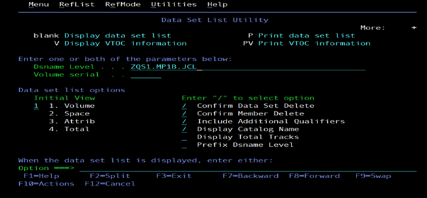

2.	Now, outside of z/OS, open up MQ Explorer on your Windows Desktop. The icon should look like this:

    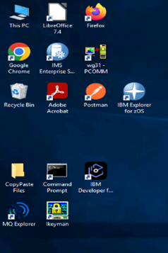

3.	Once you’ve opened MQ Explorer, you should see a left-hand menu bar like below. Right click on the ZQS1 queue manager and hit ‘Connect’.

    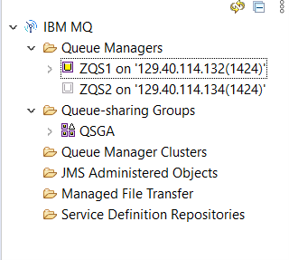

4.	By clicking on the arrow to the left of ZQS1, a dropdown list of MQ objects will appear. Right click on the ‘Queues’ folder and construct a new local queue called MP1B.TESTER.

    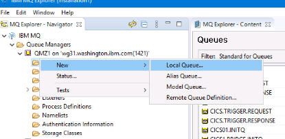

5.	Create a queue on your queue manager using MQ Explorer. The queue should have the following properties: 

    
    
> Why make the queue shareable? Great question! Shareable queues tend to come in handy in a test environment, so that developers can browse the queues.

6.	Now that we have our queue defined, head back to z/OS. 

#### II.	Make sure settings are in place to record SMF data 

7.	Now, we will enter a series of MVS commands to adjust the settings of the queue manager to prepare it for the collection of SMF data. To do this, navigate to the ISPF main menu

8.	Once in the ISPF main menu, enter ‘d’ in the command line and hit enter

9.	Once in SDSF, place a / in the command input line and hit enter

10.	A MVS command prompt like this should pop up:

    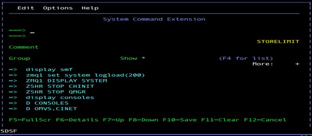

11.	Enter the following commands here, one at a time. Each command will take you out of the System Command Extension window, so you will have to use the / command to return to the correct window for executing commands.

        ZQS1 SET SYSTEM STATIME(1.00)

    To change the statistics time interval to 1 minute

    We want to modify our queue manager’s log load attribute to be super low in order to manufacture a lot of checkpointing so we see something interesting in the SMF records for the purpose of the lab

        DISPLAY SMF

    This tells us where our SMF data will be stored

        ZQS1 ALTER QMGR STATCHL(MEDIUM)

    This tells z/OS we want to enable channel statistics to be collected at a moderate ratio of data collection

        ZQS1 ALTER QMGR MONQ(MEDIUM)

    This tells z/OS to turn on monitoring for the queue manager’s queues at a moderate ratio of data collection

        ZQS1 ALTER QMGR MONCHL(MEDIUM)

    This tells z/OS to turn on monitoring for the queue manager’s channels at a moderate ratio of data collection

        ZQS1 START TRACE(STAT) CLASS(1,2,4,5)

12.	Now all the settings should be in place for our queue manager. Head back to ZQS1.MP1B.JCL using 3.4 from the main ISPF menu. 

#### III.    Run JCL to record our SMF data 

13.	We will use OEMPUT to load messages into MP1B.TESTER. In the directory ZQS1.MP1B.JCL, place an ‘e’ to the left of the OEMPUT member. 

     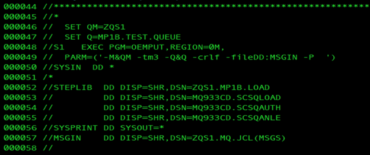

14.	Make sure that your queue manager and queue names are correct in lines 46 and 47.

15.	Once in OEMPUT, type ‘submit’ on the command line and hit enter to load persistent messages into the queue manager.

    I won’t summarize the whole JCL, but pay attention to this particular line:  

    `PARM=('-M&QM -tm3 -Q&Q -crlf -fileDD:MSGIN -P')`

    Lets break it down:

    | Parameter    | Meaning |
    | -------- | ------- |
    | '-M&QM | Queue manager name |
    |	-tm3 | Send messages for 3 minutes |
    |	-Q&Q | The queue name |
    |	-crlf | Each line in the input message file is used in sequence as message data |
    |	-fileDD:MSGIN | Use the MSGIN file as input |
    |	-P | Use persistent messages |

16.	If you look at your MQ Explorer, you should now see that your queue is populated with lots of messages! 

    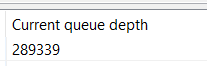

17.	Back in ZQS1.MP1B.JCL, navigate to the SMFDUMP member. Once inside, modify the date to be accurate. If you are completing this lab on 2/24/2025 at SHARE, the date will be 2025055. 

> This is a date in the Julian format.

18. Enter ‘submit’ on the command line to execute SMFDUMP JCL. The SMFDUMP JCL starts with deleting old tasks, then outputs it in a specified location, in our case, ZQS1.QUEUE.MQSMF.SHRSTRMx.

    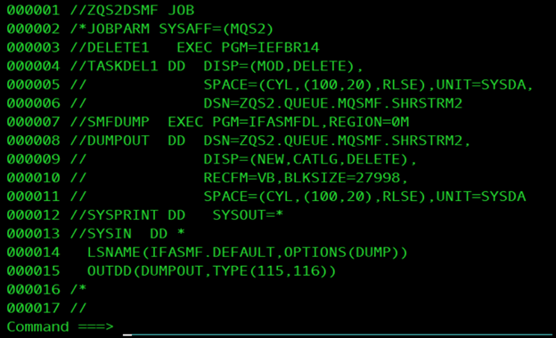

 
18.	You can check that the SMFDUMP is processing by navigating to your job using SDSF. Access SDSF using =D from the ISPF menu.
19.	Once in SDSF, select ST from the menu and hit ‘enter’
20.	Type in ‘prefix ZQS1*’. This will show you a list of all jobs submitted that start with ZQS1. Remember, we define our job names at the top left of each JCL file.  
21.	Here, you put a ‘?’ mark besides the jobname. Hit enter, then a screen with a SYSPRINT menu option should pop up. Next to SYSPRINT, put a ‘s’ and hit enter.
22.	Enter ‘bottom’ on the command line and you should see a screen like below, indicating that records are being written. You can also confirm this by looking in the output for the SUMMARY ACTIVITY REPORT.

    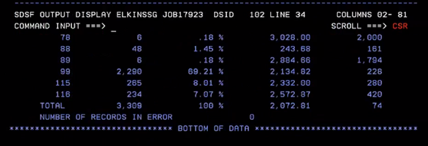

 
23.	You will have to submit one final job MQSMFP in ZQS1.MP1B.JCL. This job will give us some formatted information about the SMF data. Type ‘submit’ and hit enter.

    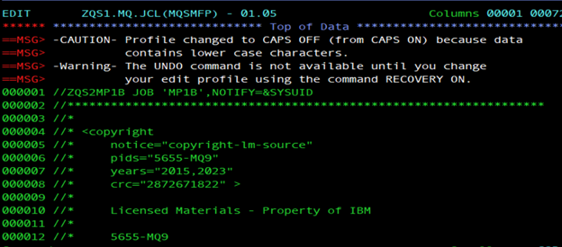

#### IV.	Navigate the SMF data output to find performance problems

24.	Now, navigate to the SDSF output for the submitted job. We will be able to see the SMF output in useful categories that can also be exported as CSV files.
 
    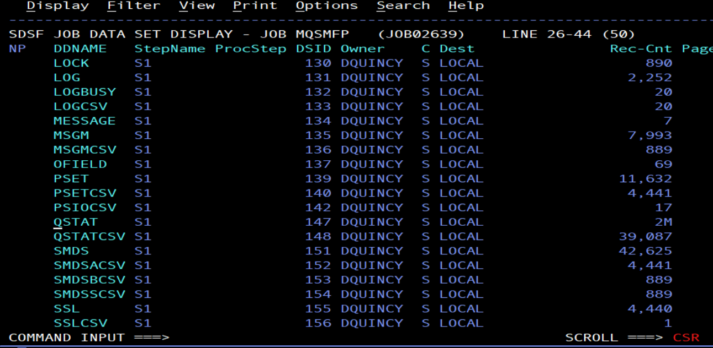

25.	Navigate to the QSTATS statistics by putting a ‘s’ next to it and hitting enter. Once inside QSTATS, on the command line, enter:

    f MP1B.TESTER

26. Voila, you should now see detailed information about the queue we set up, including the storage 

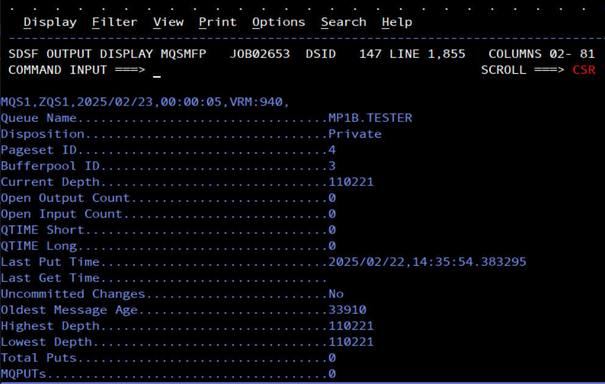

#### V.	Interpret the findings

Compare the findings above with what you are able to glean from the WQ Task Accounting records below:
 
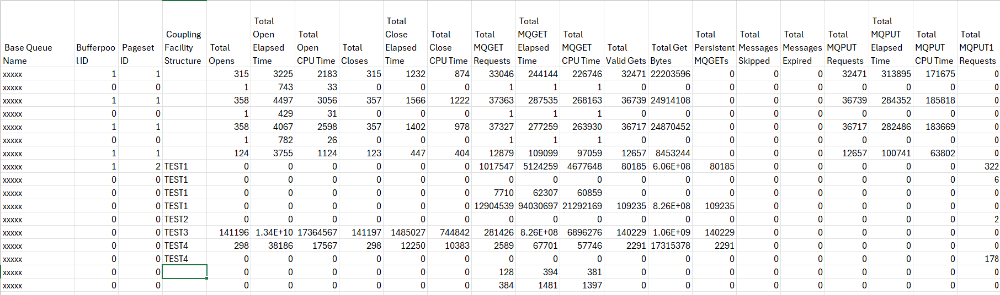

LAB FINISHED!

