# Creating Streaming queues w/ IBM MQ for z/OS
#### Audience level
Some knowledge of MQ or z/OS 
#### Skillset
MQ Administration

#### Background
This lab introduces using streaming queues to IBM MQ for z/OS. Streaming queues was released in the IBM MQ product in release version 9.2.3. The function enables you to send near-duplicate messages to a secondary queue, called the streaming queue. 

#### Overview of the exercise

#### Lab Begin

1)	If not already started, start the MQ Explorer by double clicking on the icon on the image.

2)	The application should start and show that it is at MQ Version 9.4

3)	When the application has started, there may be a selection of queue managers available.  We are interested in connections to queue managers on our z/OS environment. If you do not see connections to a queue manager you have been working with, you can create a connection by right clicking ‘Queue Managers’ and selecting to ‘Add Remote Queue Manager…’. You will then fill out all the necessary details for IP address and port number.  
 
4)	Right click on ZQS1 and select connect.  Please note that the IP address may be different from what is shown here.  

The description and command level show that this is a 9.4 queue manager on z/OS.  

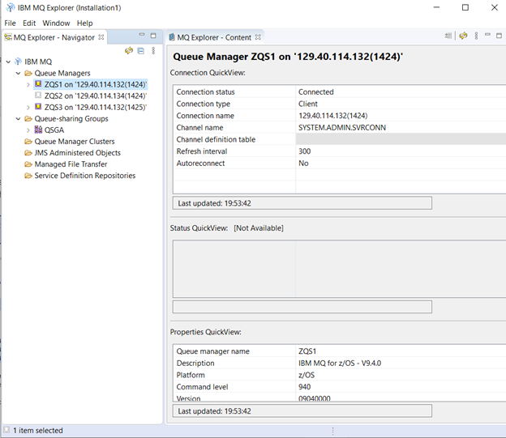

5)	Expand the ZQS1 queue manager – click on the ‘>’ beside the name to see the resources defined to this queue manager. 

6)	Click on the ‘Queues’ to see the queues that are currently defined.  Please note that the list may differ from what is shown here. For example, you may see the SYSTEM queues or temporary dynamic queues that are currently in use. 

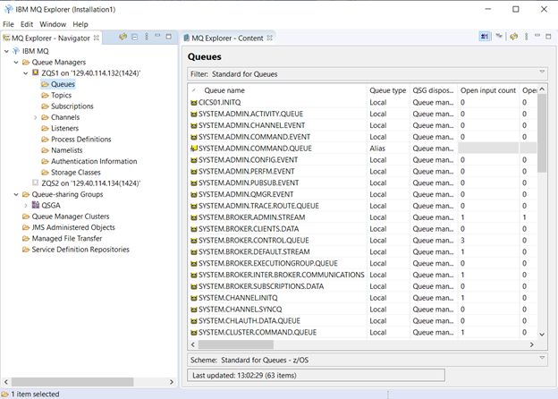

7)	Right click on the Queues under the ZQS1 queue manager and select New-> Local Queue

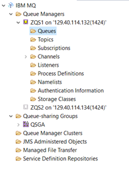

8)	The new local queue dialog box should appear, and you will type in the queue name for the streaming target queue.  It should be TEAMXX.STREAM.COPY, replacing the TEAMXX with the TEAM number you have been assigned (it will be TEAM01-TEAM20). After entering the queue name, please click on the ‘Next’ button.

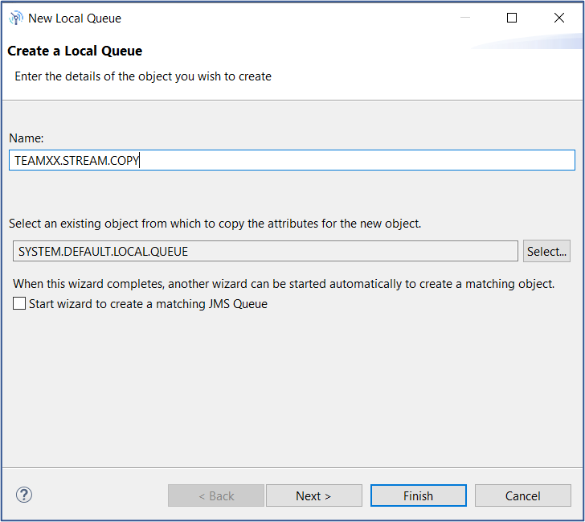

9)	On the Change Properties dialog box Please select the ‘Extended’ option and change the ‘Sharability’ to ‘Sharable’ and the ‘Default input open option’ to ‘Input Shared as shown and click on the Finish Button.

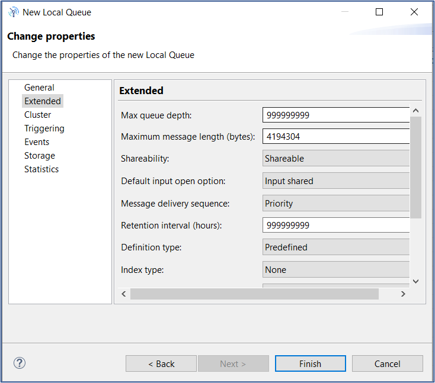

10)	The object should be successfully created, and the following dialog box should appear.  If you would like to check the ‘do not show success messages in future’ please feel free.  Please then click the OK button to clear the display. 

11)	You will now define the base queue for streaming.  Right click on the queues tab again and select ‘New’ -> ‘Local Queue’ to define the streaming base queue.  It’s name will be TEAMXX.STREAM.BASE, replacing the TEAMXX with your team number (TEAM01 thru TEAM20) . 

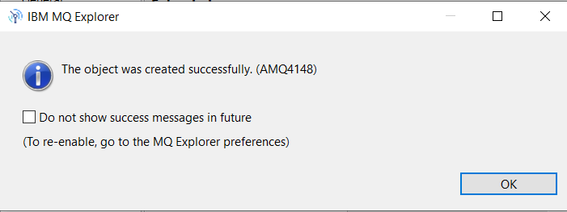

12)	Click on the Next Button.  There are both Extended and Storage tab changes that will be made.  

13)	On the ‘Extended’ tab please change the Sharability and Default Open input option to ‘Sharable’ and ‘Input Shared’ as you did for the first queue. 

14)	For those of you familiar with the Storage tab on this dialog box, there have been some changes.  The streaming queue name and quality of service are set here. 

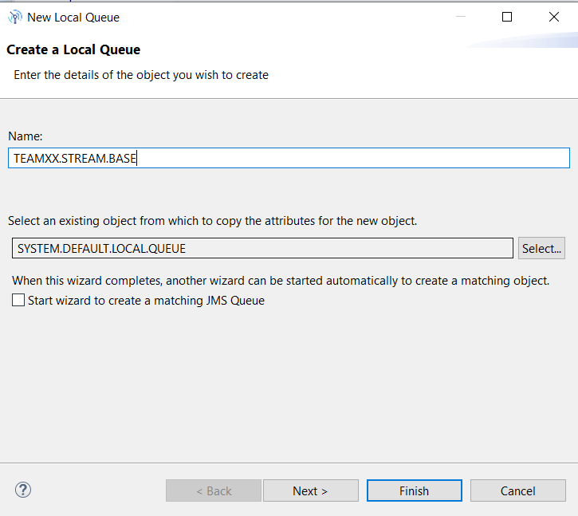

15)	The queue name may be selected from the previously defined queues by using the ‘Select’  Button and choosing the name from the dialog box.  Please select the streaming target queue defined above, you may have to scroll down to find it, and click on ‘OK’.

16)	The queue name should now be populated in the dialog box.  Please then select ‘Must duplicate’ for the 'Streaming quality of service' and click on Finish.

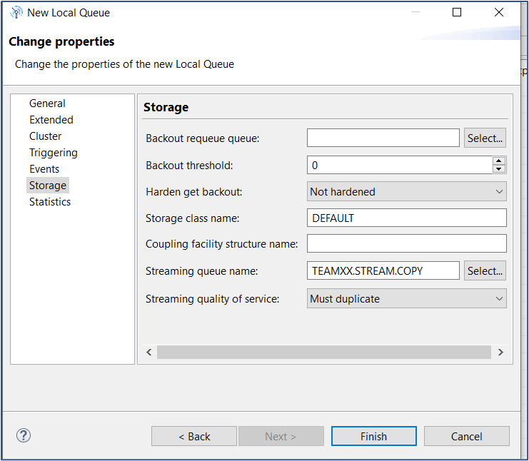

17)	To test, we are just going to put messages to the base queue.  From the queue list right click on the TEAMXX.STREAM.BASE queue (replacing TEAMXX with your team number) and select ‘Put Test message’.  In the dialog box, please enter a test message and click on the ‘OK’ button

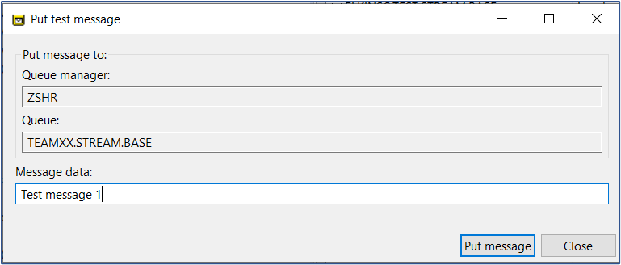

18)	Please put two more messages onto the queue, varying the contents a bit.  ‘Test 1, Test2, Test 3’ is just fine.  Click on the ‘Close’ button to return to the queue list.

19)	Click on the refresh key, in the upper right side of the queue list box to refresh the list of queues. 

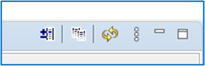

20)	You should now see that both the base and copy queues have an equal number of messages.

21)	At this point you can browse the queues.  Note that the message contents are the same as are the Message IDs on both queues.  

BASE:

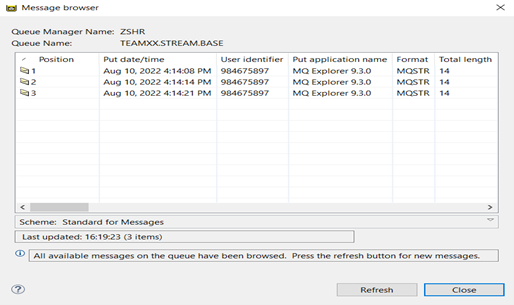
 
COPY:

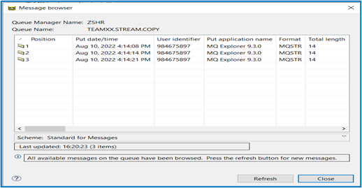

 
22)	Testing an Exception – put inhibit the COPY queue.  From the list of queues, Right click on the TEAMXX.STREAM.COPY (USE YOUR TEAM NUMBER IN PLACE OF TEAMXX) queue and select Properties.  Select ‘Inhibited’ for put messages, and click on OK.

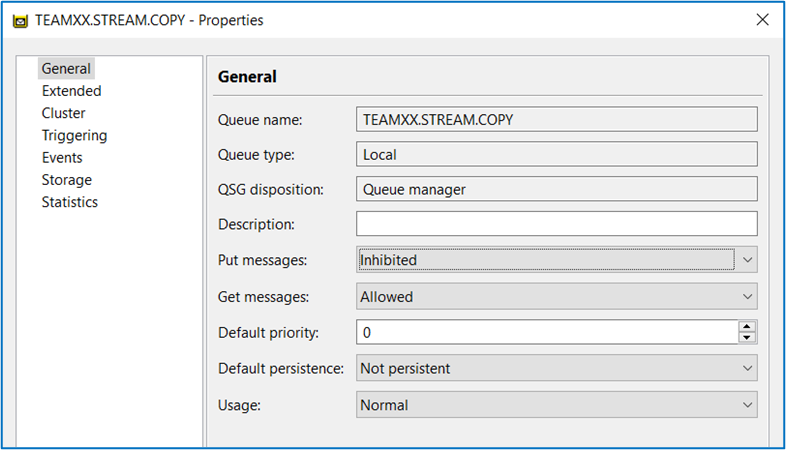

23)	Attempt to put a message on the TEAMXX.BASE.QUEUE, replacing the TEAMXX with your team ID.  

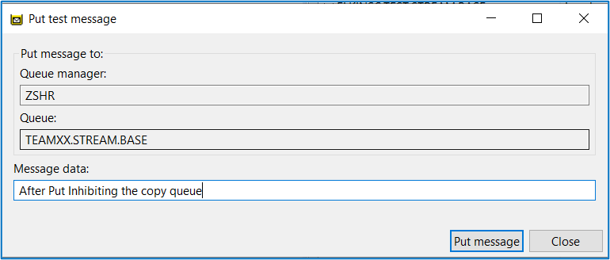

24)	You should receive a message that you cannot put a message to this queue.

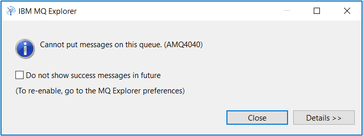

25)	Clicking on the ‘Details’ shows the reason:

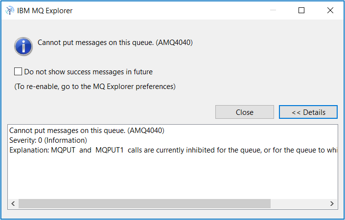
 
26)	Going back to the BASE queue, change the Streaming Quality of service from ‘Must Duplicate’ to ‘Best effort’ and click the OK button.  

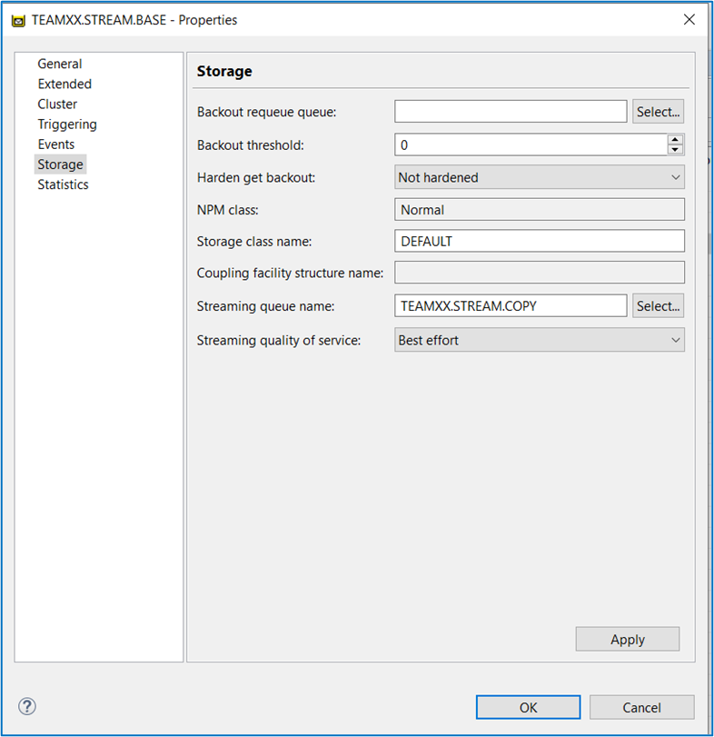
 
27)	Try to put another message to the BASE queue, like what is shown. 
 
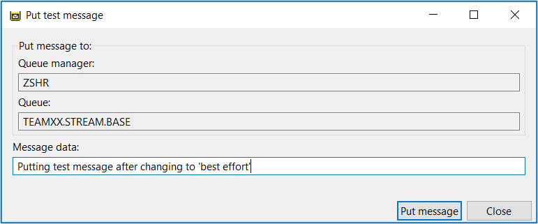

28)	That should work, and the depths of the base and copy queues should now be different: 

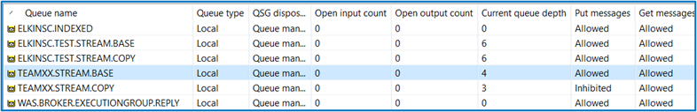

29)	Congratulations!  You have now been able to create and use a streaming, private queue.  

30)	Now, we will use the queue-sharing group defined on the environment called QSGA to create a streaming, shared queue. 

31)	On MQ explorer, under Queue-sharing groups, you should see QSGA defined. Click the drop-down to see a list of Shared Queues.  

32)	Unlike private queues, we will need to check which shared storage we should specify for our shared queues. Look under ‘Coupling Facility Structures’

33)	We will go ahead and remember TEST1 for our storage needs. Now, create a new shared queue.  

34)	We will start with defining our streaming queue like so.  

35)	Under the Storage settings, we must specify our Coupling facility structure name of choice. This is where we will put in TEST1. That is the only additional setting you will need to make for the streaming queue. Press finish.

36)	Now, we will define our base queue following the same process of creating a shared queue. Here, however, we will specify a streaming queue to point to like so. 

37)	Now, we have defined two shared queues. You should see both in the shared queues list under QSGA.  

38)	Let’s test them out! Right click the base queue and put a test message on the base queue. 

39)	Once put, you should see the message duplicated on the streaming queue. 

40)	When you navigate to the individual queue managers’ queues, you should see both the shared queues and their messages available to both ZQS1 and ZQS2.

LAB FINISHED!

