# Configuring triggering on MQ for z/OS
#### Audience level
Some knowledge of MQ, z/OS, CICS
#### Skillset
MQ Administration

#### Background

The purpose of this lab is to give you a hands-on introduction to triggering. Triggering can be used to:

(1) Automatically start a CICS transaction to process messages on a queue.

(2) Automatically start a channel when messages arrive on its transmission queue.

This lab walks you through an example of (1) using a simple example CICS program called QCOPY. The QCOPY program is executed from the QCPY transaction. When the necessary conditions are met, QCPY is triggered (or automatically started) to move messages from one queue to another in MQ, applying a message property to each message. 

#### Lab Overview

I. Defining MQ Objects for Triggering

II. Configuring CICS components

III. Testing it all out

In part I and II of the lab, we will walk through the configuration for triggering, and in part III, we will validate it works. 

By the end of this lab, you should have an understanding of how triggering is configured, so you can implement it for our own use cases.

The sample requires a currently supported version of IBM MQ and CICS. You can find the COBOL source code for the QCOPY program in ZQS1.COBOL.SOURCE if you are using the MQPLEX lab environment. If you need access to a lab sysplex, please contact the Washington Systems Center or dorothy.quincy@ibm.com.

#### Lab Begin

### I. Defining MQ Objects for Triggering

1\.	Navigate to the MQ web console. You can also use MQ Explorer or MQSC commands via PCOMM.

2\.	You will need to define several queue objects:

- QCPY.CONTROL

- QCPY.INPUT

- QCPY.OUTPUT

- QCPY.STATUS

- CICS.INITQ

3\.	Create the 5 local queues below, using the pictures to guide which parameters to set.

*a. QCPY.CONTROL - This queue contains the message used to start the QCPY transaction. For QCPY, the message payload will contain, in comma delimited format: the number of messages to be copied, the source queue, the target queue*
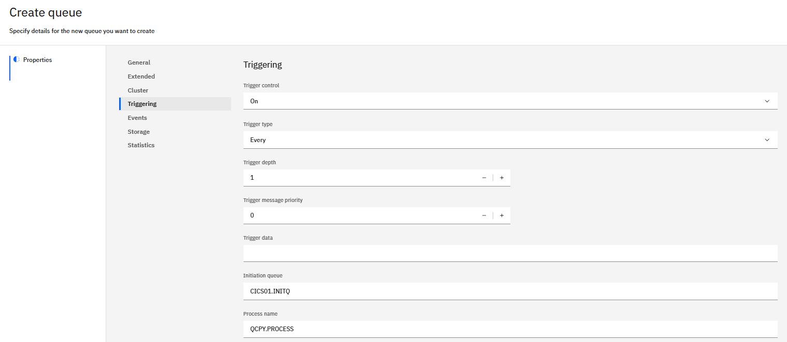
 
*b. QCPY.INPUT - The source of the messages to be copied.*
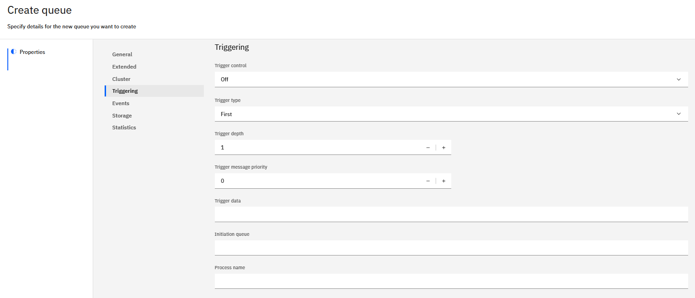

*c. QCPY.OUTPUT – The target for the copied messages.*	

*d. QCPY.STATUS – The queue which will hold the status messages, reporting on success or failure.*

*e. CICS.INITQ - The initiation queue to connect CICS to MQ for triggering purposes*
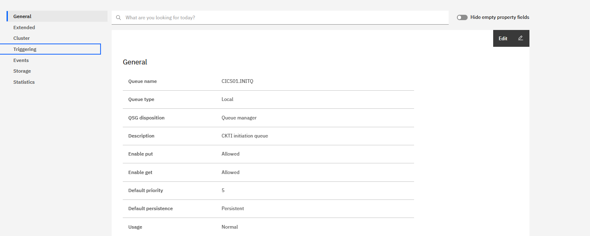

4\. Next navigate to MQS1 PCOMM.

5\. Navigate to SDSF from the ISPF main menu.

6\. Define a process using the MQSC command below on SDSF. A process is an MQ object that defines an application to the MQ Queue Manager. MQ will use the process definition to identify our CICS application, QCPY, to be started by a trigger monitor.

a.	Here, we’ll specify CICS as our application

b.	'QCPY' is our application ID. This is the transaction name in CICS

c.	Environment data is status queue which tells us what happen at the end of the process 

*QCPY.PROCESS*
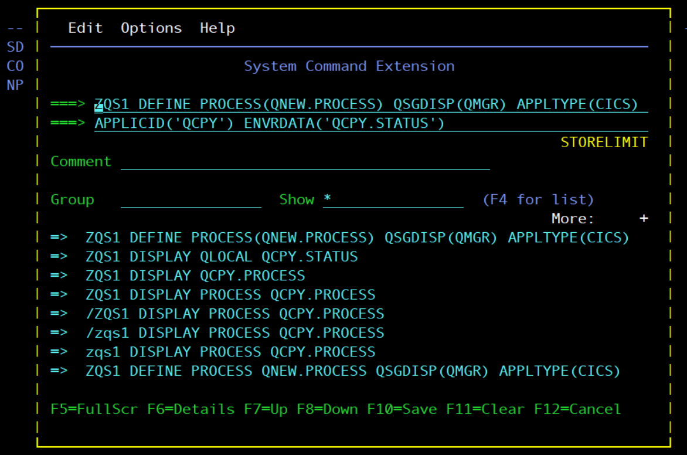

### II. Configuring CICS components

7\.	Now, ensure CICS is running. Test this via SDSF from the ISPF main menu.

8\.	Navigate to ‘da’ once in the SDSF menu to see active users.

9\.	Set the prefix to * so we can see all active users with the command ‘prefix *’. Then, using the F7 and F8 keys, navigate to see if CICS is running. You should see something like this:

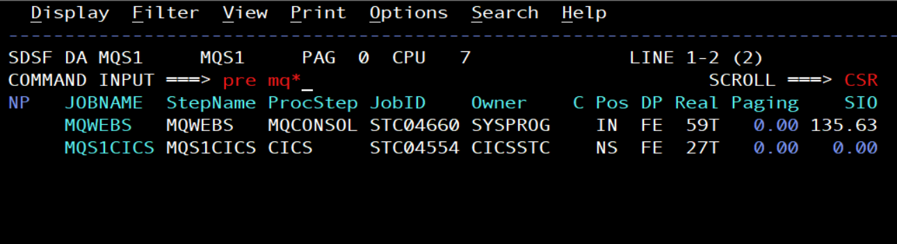

10\.	If there is no CICS region active, you will need to start the CICS region w/ command ‘start MQS1CICS’

11\.	Once you've validated CICS is running, navigate to the CICS display by starting another MQS1 PCOMM session. From the main screen, use the MQS1CICS command and press enter.

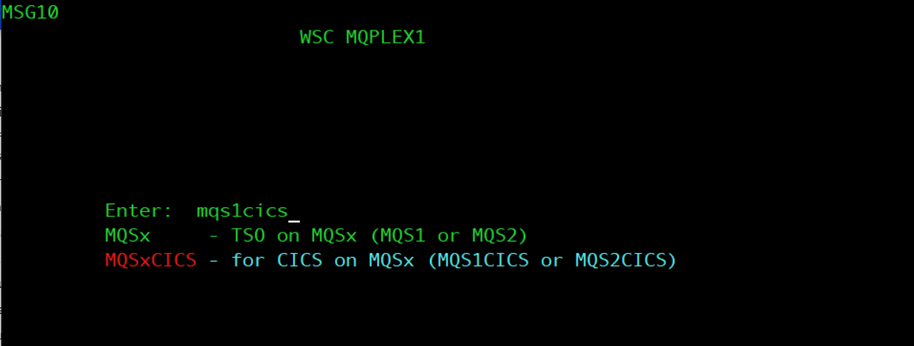

12\.	From the CICS main screen, hit tab once, then type in CKQC. This is the MQ CICS transaction CKQC. This transaction makes it possible to monitor and control the interface between MQ and CICS.

13\.	Currently, no one is listening, so we’ll need to add a listener to CICS01.INITQ. From z/OS CICS screen, navigate to CKQCM0 by typing in the command.

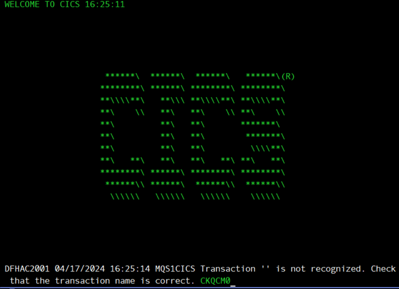

14\.	This screen should pop up. 

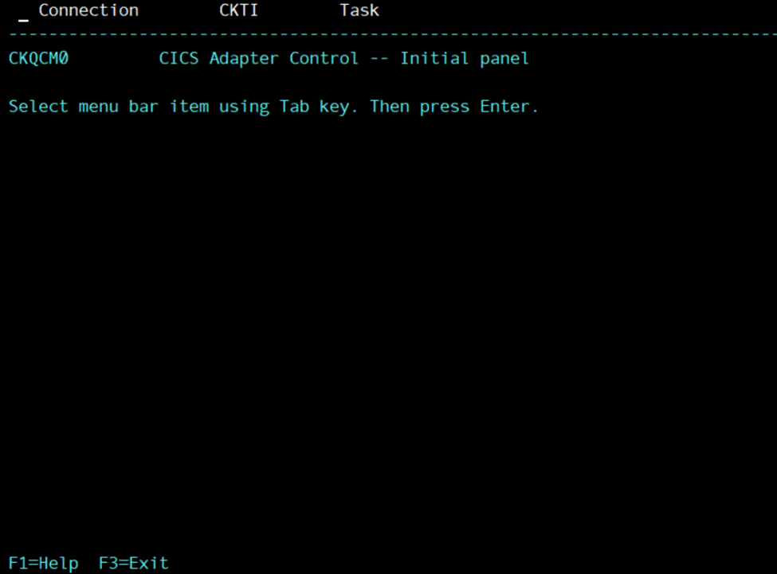

15\.	Enter the tab or tab button with your cursor next to the Connection option. The following menu will pop up. Type in option 1 and press enter.

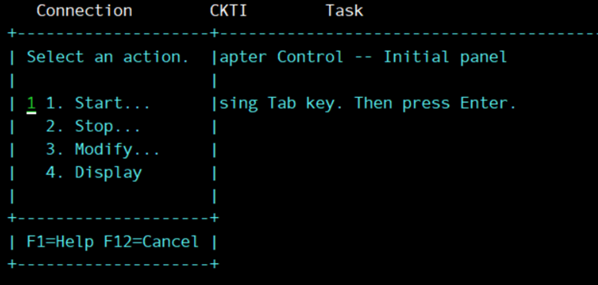

16\. Enter in your appropriate queue manager name and initiation queue name and press enter.

17\. Press F12 to return to the main menu. Move your cursor next to CKTI option and press enter. The following menu will pop up. Type in option 1 and press enter.

18\.	Enter in your appropriate queue queue name and press enter.

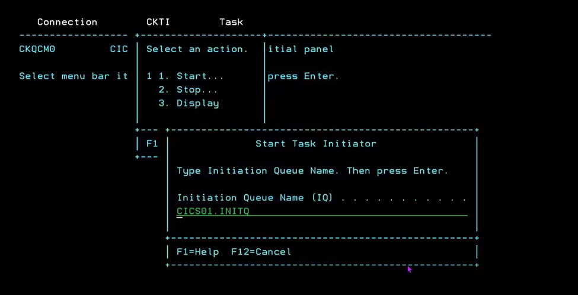
    
This step initiates the CKTI transaction, which is what controls the CICS trigger monitor.

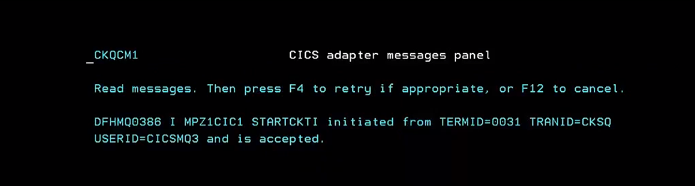

19\. F12 to escape. If you display your connection or CKTI using the menu options, you should see the appropriate initiation queue linked, similarly to the examples below. You will also now see that your CICS.INITQ in MQ has a open input count of 1.

Connection display:
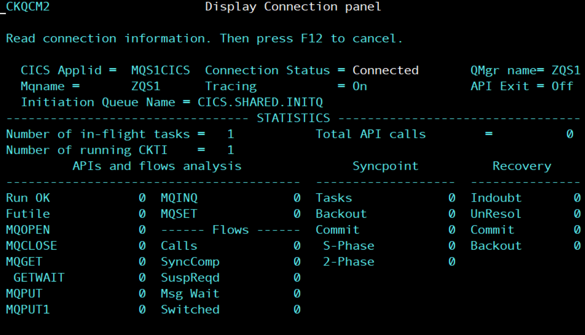

CKTI display:
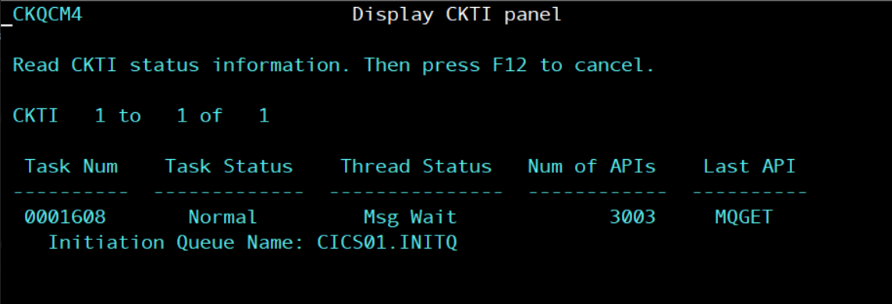

### III. Testing it out

20\.	Now, we have all of our necessary objects (queues and process) configured, we have our connection between MQ and CICS configured, so we are all set to test out triggering. 

21\. Navigate to the web console. Once in the web console, navigate to the QCPY.INPUT queue. 

22\. Place several test messages on the QCPY.INPUT queue. Place at least 5 messages on the queue. The message payload can be any text you'd like.

23\. Now, put a test message on QCPY.CONTROL. The message MUST be in the format below: 

`
2,QCPY.INPUT,QCPY.OUTPUT
`
where 2 is the number of messages you want to copy, QCPY.INPUT is the input queue, and QCPY.OUTPUT is the output queue.
 
This message requests that MQ copies 2 messages from QCPY.INPUT to QCPY.OUTPUT. After you submit this, check it worked by looking at the queue depths of QCPY.INPUT an QCPY.OUTPUT. QCPY.INPUT should have 2 less messages, QCPY.OUTPUT should have 2 more messages.

24\. Next, look at the QCPY.STATUS messages. You should see a new message on the queue confirming the QCPY was successful:

`
MESSAGES COPIED  =  000002 
FROM QUEUE =       QCPY.INPUT
TO QUEUE =         QCPY.OUTPUT
`

25\.	Congratulations! You have successfully used a CICS application for triggering! To recap, we created all the necessary objects and ran an experiment to copy messages from our source queue to our target queue, seen below.

