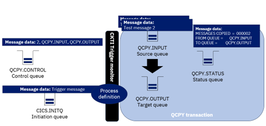

# Creating Streaming queues w/ IBM MQ for z/OS
#### Audience level
Some knowledge of MQ or z/OS 
#### Skillset
MQ Administration

#### Overview

This lab walks you through a triggering example using a sample COBOL MQ CICS program, QCOPY. The QCOPY program is executed from the QCPY transaction.  It copies messages from one queue to another, applying a message property to each message.  It is started by a comma delimited control message which triggers the transaction.  It also uses information from the IBM MQ process object. The sample requires a currently supported version of IBM MQ and CICS. You can find the source code in COBOL for this application in ZQS1.COBOL.SOURCE. 

#### QCOPY Program Flow

1.	The QCPY transaction is triggered.
2.	The control queue QCPY.CONTROL is opened.
3.	The copy control message is read . 
4.	Control message is parsed into the controlling fields.
5.	The source queue QCPY.INPUT is opened.
6.	The target queue QCPY.OUTPUT is opened.
7.	In a loop, messages are read from the source queue and written to the target queue.   
8.	The status message is built.
9.	The status queue QCPY.STATUS opened and the status message is put.
10.	All queues are closed.
11.	Control is returned to CICS.

#### Lab Begin

1.	First thing we need to do is ensure CICS is running. We can test this via sdsf from the main menu
 

2.	Navigate to ‘da’ once in the SDSF menu to see active users.
3.	Set the prefix to * so we can see all active users with the command ‘prefix *’. Then, using the F7 and F8 keys, navigate to see if CICS is running. You should see something like this:
4.	If there is no CICS region active, you will need to start the cics1 region w/ command ‘start MQS1CICS’
5.	To navigate to CICS, start another MQS1 PCOMM session and use the MQS1CICS command
6.	From the CICS main screen, hit tab once, then type in CKQC. This is the MQ CICS transaction CKQC. This transaction makes it possible to monitor and control the interface between MQ and CICS .
7.	
 
8.	Now navigate to MQ Explorer. 
9.	You will need to define several queue objects:
a.	QCPY.CONTROL
b.	QCPY.INPUT
c.	QCPY.OUTPUT
d.	QCPY.STATUS
10.	You can see the properties for all of these queues below

QCPY.CONTROL
Control Message – the message used to start the QCPY transaction.  For QCPY, the message contains, in comma delimited format:
1. The number of messages to be copied 
2. The source queue
3. The target queue

QCPY.INPUT - The source of the messages to be copied.  
 

QCPY.OUTPUT – The target for the copied messages.	
 

QCPY.STATUS – The queue which will hold the status messages, reporting on success or failure

11.	You will also need a process definition. A process is an MQ object that defines an application to the MQ Queue Manager. The process definition is used to identify applications to be started by a trigger monitor. It includes application ID and type, plus some application-specific data. 
a.	Here, we’ll specify CICS as our application
b.	‘QCPY is our application ID. This is the transaction name in CICS
c.	Environment data is status queue which tells us what happen at the end of the process 
QCPY.PROCESS

12.	Now that we have our queues configured, we will use the QCPYLOAD JCL is used to load up messages onto our queue. QCPYLOAD puts test messages onto QCPY.INPUT using OEMPUT program.
 
Copies from QCPY.INPUT to QCPY.OUTPUT based on a control card that we give it in QCPY.CONTROL

The input here is: number of messages you want to copy, the input queue, the output queue
13.	Currently, no one is listening, so we’ll need to add a listener to CICS01.INITQ. Set up a CICS.INITQ local queue with the following properties:

14.	From z/OS CICS screen, navigate to CKQCM0 by typing in the command:
15.	This screen should pop up. 
16.	Hit the tab button. The following menu will pop up. Type in option 1 and hit enter.
17.	Enter in the following details and hit enter:
 
This step initiates the CKTI transaction, which is what controls the CICS trigger monitor.
 
18.	Put a test message on QCPY.CONTROL to see everything works.
 
19.	This message requests that MQ copies 2 messages from QCPY.INPUT to QCPY.OUTPUT. After you submit this, check it worked by looking at the queue depth. 

20.	Next look at the QCPY.STATUS messages. You should see a new message on the queue confirming the QCPY was successful:

	
MESSAGES COPIED  =  000002 
FROM QUEUE =       QCPY.INPUT
TO QUEUE =         QCPY.OUTPUT

21.	Congratulations! You have successfully used a CICS application for triggering! Next, we’ll look at what we’d do in a more realistic scenario, where you have many messages flowing through MQ.
22.	Navigate to option 3.4 from your ISPF main menu on MQS1.
23.	Search for the following dataset: ZQS1.COBOL.JCL
24.	Choose to browse the data set by putting a ‘B’ to the left of the name and hitting enter.
25.	Once inside the dataset, you’ll see a list of several members. Use the command ‘sort changed’ or navigate the list using F7 and F8 until you see member ‘QCPYLOAD’. Place an ‘E’ to the left of QCPYLOAD and hit enter like so:
26.	Browse through the JCL in QCPYLOAD using F7 and F8. You’ll notice that this JCL is an execution of OEMPUT. We’re going to load up our QCPY.INPUT queue with 500 messages.
27.	Submit the JCL using the command line like so:
28.	Nice! You should receive a RC=0 upon submitting. You can check that the message loading process worked by navigating to MQ Explorer. On MQ Explorer, you will now see QCPY.INPUT has 500 more messages in the queue. 
29.	Next, navigate back to your terminal display. From here, we will now execute the QCPYT2 job. From the ZQS1.COBOL.JCL members, place an ‘b’ next to QCPYT2.
30.	Before submitting, take a second to see what is being done here. We specify that we want to copy 10 messages from QCPY.INPUT to QCPY.OUTPUT and we will be using the same OEMPUT execution to do this. However, our target queue for OEMPUT here is QCPY.CONTROL, not QCPY.INPUT.

31.	Enter submit in the command line below the job and hit enter.
32.	Now, assuming the job completed successfully, you should be able to look over at MQ Explorer and see 10 messages moved from Q
33.	
34.	
35.	CPY.INPUT to QCPY.OUTPUT. 
36.	That is the QCPY lab! Here, you practiced triggering using a CICS application using a rudimentary example and a more advanced example.

