# Configuring Triggering on IBM MQ for z/OS

#### Audience level
Some knowledge of MQ, z/OS, and CICS

#### Skillset
MQ Administration

#### Background

The purpose of this lab is to provide a hands-on introduction to MQ triggering. Triggering can be used to:

- Automatically start a channel when messages arrive on its transmission queue
- Automatically start a CICS transaction to process messages on a queue

This lab demonstrates the second use case by using a simple example CICS program called `QCOPY`. The `QCOPY` program is executed from the `QCPY` transaction. When the required triggering conditions are met, `QCPY` is started automatically to move messages from one queue to another in MQ and apply a message property to each message.

#### Lab overview

This lab has three parts:

I. Defining MQ objects for triggering

II. Configuring CICS components

III. Testing the solution

In parts I and II, you will configure the MQ and CICS objects required for triggering. In part III, you will test the end-to-end flow.

By the end of this lab, you should understand how MQ triggering with CICS is configured so you can adapt the pattern to your own use cases.

This sample requires a currently supported version of IBM MQ and CICS. If you are using the MQPLEX lab environment, the COBOL source for the `QCOPY` program is available in `ZQS1.COBOL.SOURCE`. If you need access to a lab sysplex, contact the Worldwide Systems Center or your IBM technical sales contact.

### Prerequisites

Before you begin, make sure the following are available:

- A running queue manager, for example `ZQS1`
- A CICS region that is configured to work with MQ
- Access to the MQ web console, MQ Explorer, or MQSC through PCOMM
- Authority to define MQ objects and access the required CICS transactions
- The `QCOPY` sample program and `QCPY` transaction installed in the target CICS region
- A working MQ-CICS connection and the ability to start the CICS trigger monitor (`CKTI`)

> Note: This lab assumes the objects are created on queue manager `ZQS1`. If you use a different queue manager, substitute that name consistently throughout the lab.

#### Procedure

### I. Defining MQ objects for triggering

1. Navigate to the MQ web console. You can also use MQ Explorer or MQSC commands through PCOMM if preferred.

2. Create the following five local queues. Use the screenshots to guide the parameter settings.

   **`QCPY.CONTROL`**
   This queue contains the trigger message used to start the `QCPY` transaction. For `QCPY`, the message payload contains, in comma-delimited format, the number of messages to copy, the source queue, and the target queue.
   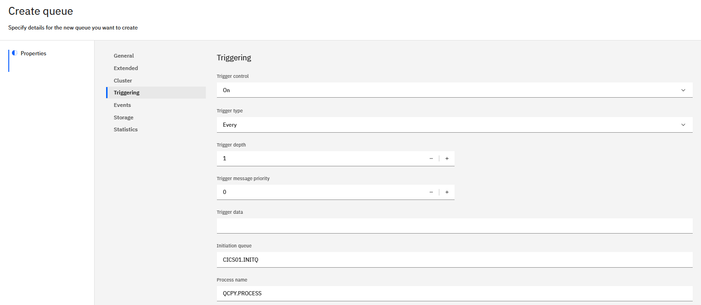

   **`QCPY.INPUT`**
   The source queue for the messages to be copied.
   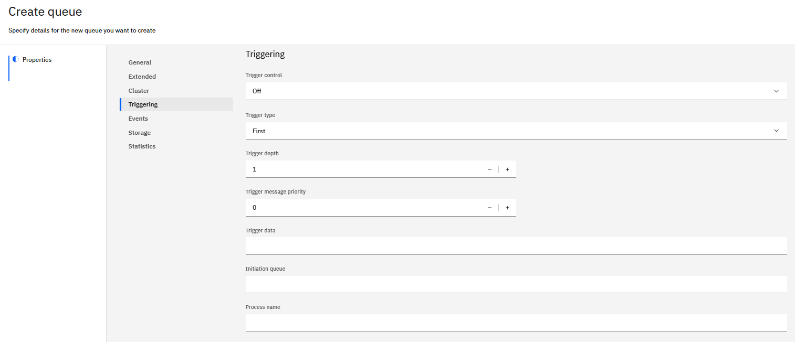

   **`QCPY.OUTPUT`**
   The target queue for the copied messages.
   

   **`QCPY.STATUS`**
   The queue that receives status messages indicating success or failure.
   

   **`CICS.INITQ`**
   The initiation queue used to connect CICS to MQ for triggering.
   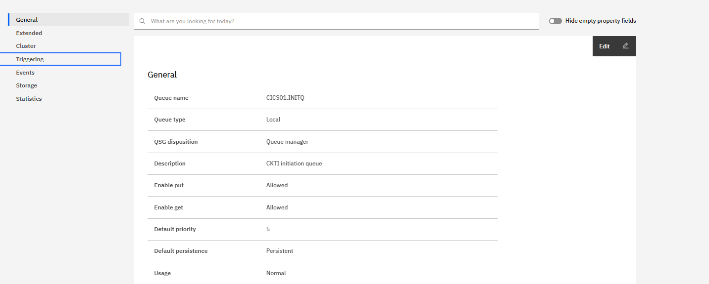

3. Next, navigate to the `MQS1` PCOMM session.

4. From the ISPF main menu, navigate to SDSF.

5. Define a process using the MQSC command shown in the screenshot below. A process is an MQ object that identifies an application to the queue manager. MQ uses the process definition to identify the CICS application, `QCPY`, that should be started by the trigger monitor.

   - Specify `CICS` as the application type
   - Specify `QCPY` as the application ID; this is the CICS transaction name
   - Use the environment data to identify the status queue, which reports the result of processing

   **`QCPY.PROCESS`**
   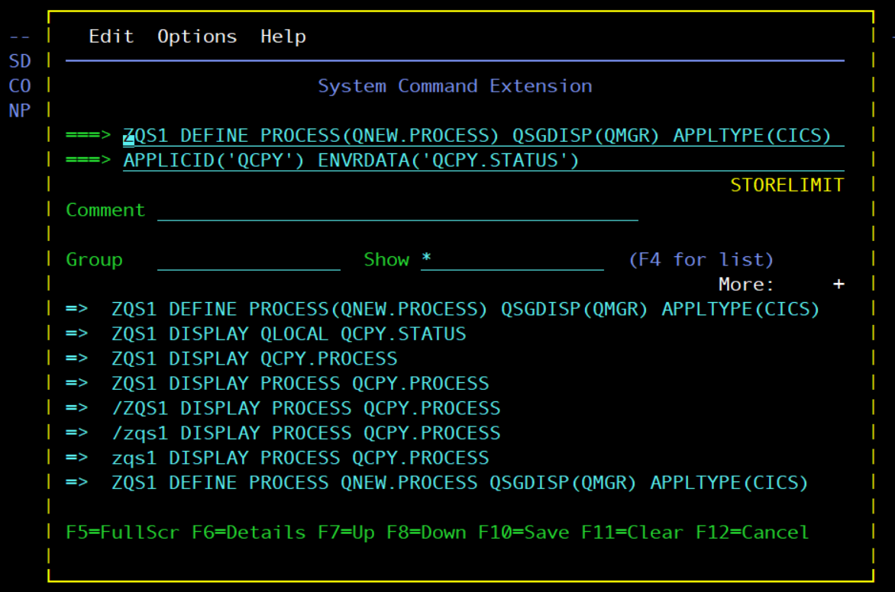

### II. Configuring CICS components

6. Ensure that CICS is running. You can verify this from SDSF.

7. In SDSF, enter `DA` to display active address spaces.

8. Set the prefix to `*` by entering:

   ```text
   PREFIX *
   ```

   Then use `F7` and `F8` to look for the active CICS region. You should see something similar to the following:

   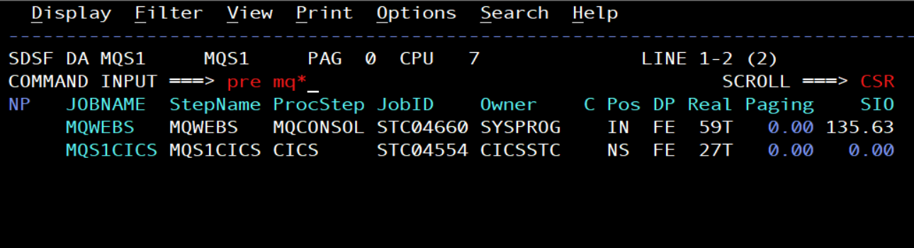

9. If no CICS region is active, start it with:

   ```text
   START MQS1CICS
   ```

10. Once you have confirmed that CICS is running, start another `MQS1` PCOMM session. From the main screen, enter `MQS1CICS` and press Enter.

    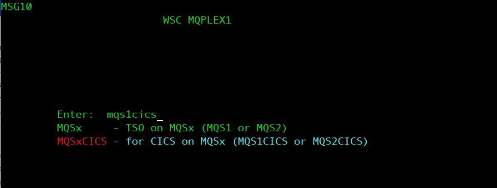

11. From the CICS main screen, press Tab once and type `CKQC`. This is the MQ CICS transaction used to monitor and control the interface between MQ and CICS.

12. If no trigger monitor is active, you will need to add a listener for `CICS.INITQ`. From the CICS screen, navigate to `CKQCM0` by typing the command.

    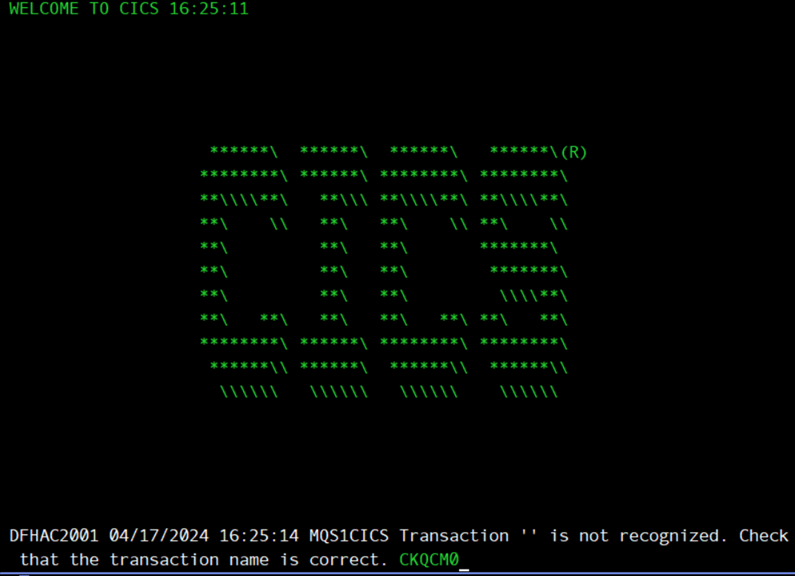

13. The following screen should appear:

    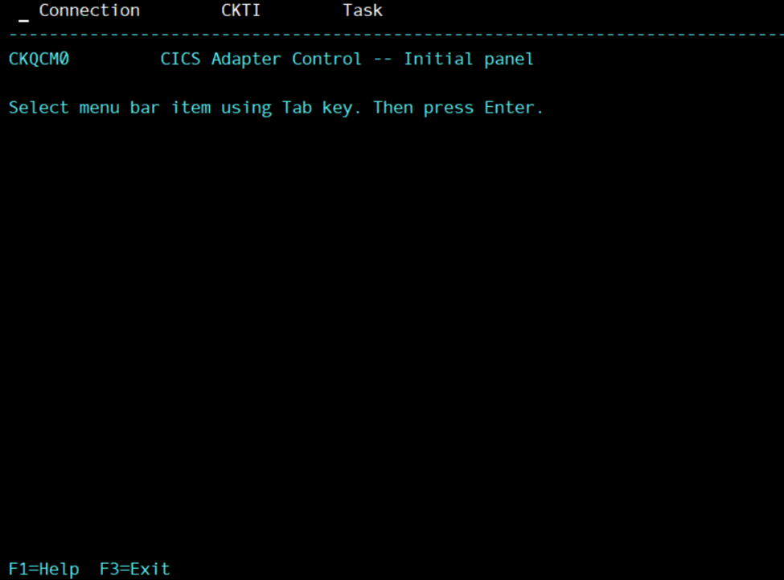

14. Move the cursor to the **Connection** option, then press Enter. When the menu appears, type option `1` and press Enter.

    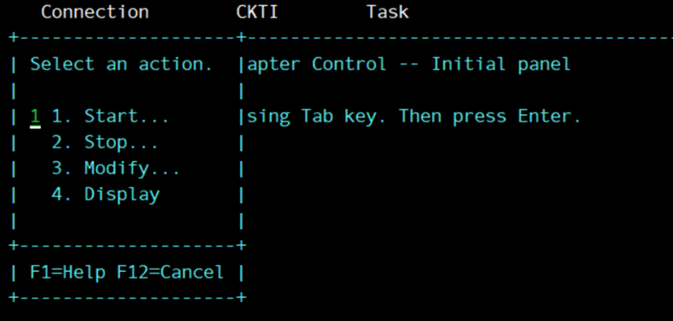

15. Enter the appropriate queue manager name and initiation queue name, then press Enter.

16. Press `F12` to return to the main menu. Move the cursor to the **CKTI** option and press Enter. When the menu appears, type option `1` and press Enter.

17. Enter the appropriate initiation queue name and press Enter.

    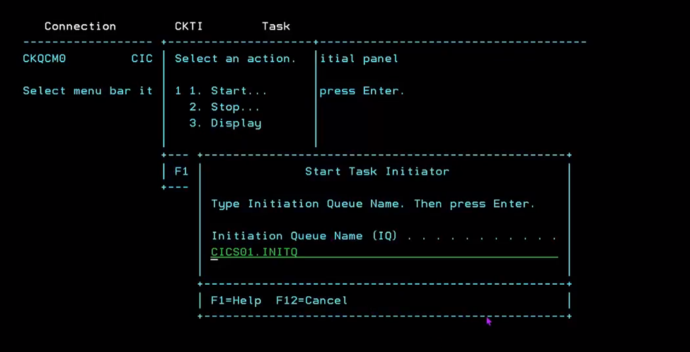

    This step starts the `CKTI` transaction, which controls the CICS trigger monitor.

    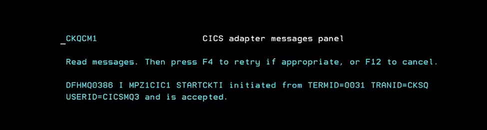

18. Press `F12` to exit. If you display the connection or `CKTI` definition using the menu options, you should see the initiation queue associated correctly, similar to the examples below. You should also see that `CICS.INITQ` in MQ now has an open input count of `1`.

    Connection display:
    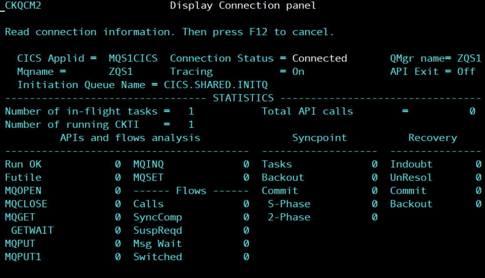

    CKTI display:
    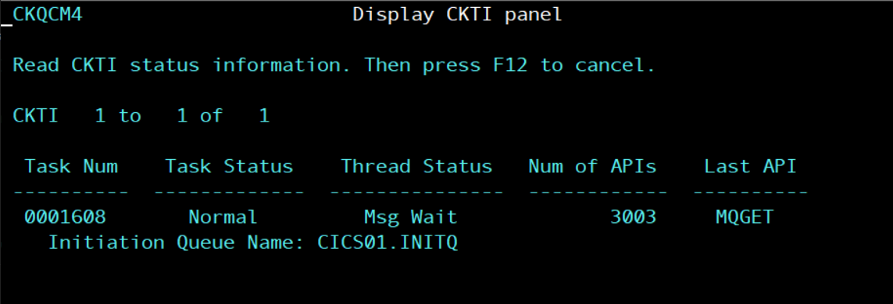

### III. Testing the solution

19. At this point, the required MQ objects and CICS configuration should be in place, so you are ready to test the triggering flow.

20. Return to the MQ web console and navigate to the `QCPY.INPUT` queue.

21. Put several test messages onto `QCPY.INPUT`. Add at least five messages. The message payload can contain any text.

22. Now put a control message onto `QCPY.CONTROL`. The message must be in the following format:

   ```text
   2,QCPY.INPUT,QCPY.OUTPUT
   ```

   In this example:
   - `2` is the number of messages to copy
   - `QCPY.INPUT` is the source queue
   - `QCPY.OUTPUT` is the target queue

   This message requests that MQ copy two messages from `QCPY.INPUT` to `QCPY.OUTPUT`.

23. After submitting the control message, verify the result by checking the queue depths of `QCPY.INPUT` and `QCPY.OUTPUT`. `QCPY.INPUT` should have two fewer messages, and `QCPY.OUTPUT` should have two more messages.

24. Next, look at the messages on `QCPY.STATUS`. You should see a status message confirming that `QCPY` completed successfully, for example:

   ```text
   MESSAGES COPIED  =  000002
   FROM QUEUE =       QCPY.INPUT
   TO QUEUE =         QCPY.OUTPUT
   ```

25. Congratulations. You have successfully used a CICS application with MQ triggering. In this lab, you created the necessary MQ objects, configured the MQ-to-CICS connection, and verified that triggered processing copied messages from a source queue to a target queue.

   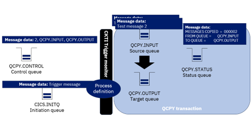

### Troubleshooting

If the test does not work as expected, check the following:

- `QCPY.PROCESS` exists and identifies the `QCPY` CICS transaction
- `QCPY.CONTROL` is defined for triggering and references the correct initiation queue and process
- `CICS.INITQ` exists on the correct queue manager
- `CKTI` is active in CICS
- The MQ-CICS connection is active
- The `QCOPY` program and `QCPY` transaction are installed in CICS
- The control message format is correct
- The queue manager name used in CICS matches the queue manager where the MQ objects were defined

Typical symptoms and causes:
- No trigger occurs: `CKTI` is not active, the initiation queue is wrong, or `QCPY.CONTROL` is not defined as a triggered queue
- Trigger message is generated but nothing runs: the CICS connection or `QCPY` transaction definition is missing
- Messages do not move: the control message format is wrong or the source or target queue names are incorrect
- `CICS.INITQ` open input count is `0`: CICS is not monitoring the initiation queue
